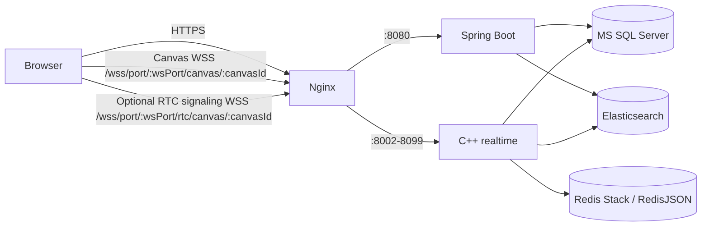

# Project Agora BE

Project Agora의 애플리케이션 및 실시간 협업 서버입니다. Spring Boot는 인증, 캔버스 메타데이터, 서버 할당을 담당하고 C++ 서버는 WebSocket 연결과 실시간 이벤트를 처리합니다.

저장소 인프라는 [Project Agora DB](../project-agora-DB)에서 실행합니다.

## 구성



| 구성 요소 | 역할 | 기본값·예시 |
| --- | --- | --- |
| `spring/` | REST API, JWT, 사용자·캔버스 관리, 서버 할당 | `127.0.0.1:8080` |
| `cpp/` | C++ REST 제어 API, uWebSockets 실시간 이벤트 | 기본 `HOST=0.0.0.0`, REST `8000`, WS `8002`; 아래 운영 예시는 loopback 바인드 |
| `nginx/` | HTTPS/WSS 역방향 프록시 | `:443` |
| MS SQL Server | 계정, 세션, 캔버스 배정, 서버 메타데이터 | `127.0.0.1:1433` |
| Redis Stack | 활성 캔버스 RedisJSON 문서와 RediSearch 색인 | `127.0.0.1:6379` |
| Elasticsearch | 캔버스 문서 영구 저장소 | `127.0.0.1:9200` |

## 캔버스 접속 흐름

1. 사용자는 `POST /api/auth/login`으로 일반 JWT를 받습니다.
2. `POST /api/canvases/{canvasId}/access`가 캔버스 비밀번호를 확인하고 heartbeat 및 REST health check를 통과한 C++ 서버를 선택한 뒤 설정 revision을 담은 캔버스 전용 JWT를 발급합니다. 참여 권한 확인은 C++ WebSocket 연결 시 수행합니다.
3. 클라이언트는 응답의 `ws_port`를 사용해 캔버스 WebSocket에 연결합니다. 이 연결 하나가 캔버스 이벤트의 송신과 수신을 모두 처리합니다.
4. C++ 서버는 JWT를 확인한 뒤 캐시 할당이나 세션 예약 전에 Redis/Elasticsearch에서 참여자와 설정 revision을 한 번 검증합니다. 통과한 경우에만 사용자 세션을 예약하고 캔버스를 로드합니다. 로드 직후에는 참여자 권한을 재검사하지 않고 revision만 비교해 확인과 로드 사이의 설정 변경을 막습니다.
5. 항목 이벤트는 권한 그룹에 따라 전달되고 RedisJSON에 저장됩니다. 마지막 사용자가 나가면 Redis 문서를 Elasticsearch에 저장한 뒤 캐시 배정을 해제합니다.

WebRTC를 사용할 때 클라이언트는 별도의 RTC 신호 WebSocket도 엽니다. 캔버스와 RTC 신호 연결은 같은 `ws_port`를 쓰지만 서로 다른 URL 경로와 독립된 WebSocket 연결입니다. 캔버스 WebSocket의 `init_items.rtc_canvas_connection_id`를 RTC 신호 연결의 `rtc_join` 이벤트에 담아 보내면 해당 캔버스 WebSocket과 RTC 피어가 연결됩니다. 피어 목록과 신호 대상은 캔버스별로 분리됩니다. 캔버스 WebSocket이 닫히면 그 연결에 묶인 RTC 피어만 즉시 해제하며 RTC 신호 WebSocket은 열린 상태로 남습니다. `rtc_disconnect`도 피어 등록만 해제하고 RTC 신호 WebSocket을 닫지 않습니다. 두 경우 모두 실제 WebRTC 연결을 닫는 것은 클라이언트의 책임입니다. `user_sessions`와 캔버스 활성 상태는 캔버스 WebSocket만 기준으로 갱신됩니다. C++ 서버는 SDP와 ICE 정보만 지정 피어에게 전달하며 실제 WebRTC 미디어·데이터 패킷을 경유시키지 않습니다. 외부 TURN 사용 여부는 클라이언트의 ICE 설정에 달려 있습니다.

캔버스 이벤트는 하나의 양방향 WebSocket으로 송수신합니다. 과거 RX/TX TCP 소켓 구현은 제거되었습니다.

C++ 서버는 5초마다 `cpp_server.last_heartbeat_at`을 갱신합니다. Spring은 15초 이내 heartbeat와 `/health` 응답을 모두 만족한 서버만 재사용합니다.

## 사전 요구 사항

- JDK 26
- CMake 3.16 이상, C++17 컴파일러, `pkg-config`
- `cpp-httplib`, `nlohmann-json3`, OpenSSL, FreeTDS (`sybdb`), zlib 개발 패키지
- Docker 및 Docker Compose v2
- Project Agora DB의 MS SQL Server, Redis Stack, Elasticsearch
- TLS 인증서와 Nginx (외부 WSS 제공 시)

Ubuntu 환경에서는 제공되는 스크립트를 통해 위 종속성들을 한번에 설치할 수 있습니다:

```bash
chmod +x install_dependencies.sh
# Oracle이 공개한, 내려받을 JDK 아카이브와 정확히 일치하는 SHA-256을 지정합니다.
JDK_SHA256=<official-sha256> ./install_dependencies.sh
```

설치 스크립트는 SHA-256이 주어지지 않으면 JDK를 설치하지 않습니다. `latest` URL을 사용할 때는 Oracle의 해당 아카이브 체크섬을 매 실행 전에 확인해야 합니다. 운영 환경에서는 고정된 JDK URL과 그 SHA-256을 함께 지정하는 것을 권장합니다.

## 환경 변수

운영 비밀값은 Git에 넣지 않습니다. 프로젝트 루트의 `.env`를 만들고 권한을 제한합니다.

```bash
cd /path/to/project-agora-BE
umask 077
cat > .env <<'EOF'
DB_HOST=127.0.0.1
DB_PORT=1433
DB_NAME=agora_db
DB_USER=agora_user
DB_PASSWORD=<mssql-application-password>

JWT_SECRET=<32바이트-이상의-무작위-공유-키>
ADMIN_PASSWORD=<초기-관리자-비밀번호>

ES_HOST=127.0.0.1
ES_PORT=9200
ES_INDEX=canvas
ES_USER_NAME=agora_user
ES_USER_PASSWORD=<elasticsearch-application-password>

REDIS_USER=agora_user
REDIS_USER_PASSWORD=<redis-application-password>

# 브라우저에서 별도 프론트엔드 도메인으로 API를 호출할 때만 지정합니다.
# 여러 도메인은 쉼표로 구분합니다. 같은 도메인에서 제공하면 비워 둡니다.
CORS_ALLOWED_ORIGINS=https://app.example.com
EOF
chmod 600 .env
```

`JWT_SECRET`은 Spring과 모든 C++ 인스턴스가 반드시 같은 값을 사용해야 하며 UTF-8 기준 최소 32바이트가 필요합니다. 양쪽은 캔버스 JWT에 HS256 서명을 사용합니다. `ADMIN_PASSWORD`는 사용자가 아직 하나도 없을 때만 초기 관리자 생성에 사용됩니다. DB 저장소의 `MSSQL_PASSWORD`, `ES_USER_PASSWORD`, `REDIS_USER_PASSWORD`와 BE의 해당 값은 일치해야 합니다.

MSSQL은 기본적으로 TLS 인증서 검증을 사용합니다. 개발 환경에서 검증 가능한 인증서를 구성할 수 없는 경우에만 `DB_TRUST_SERVER_CERTIFICATE=true`를 일시적으로 지정하고, 운영에서는 설정하지 마세요.

## 로컬 실행

먼저 DB 저장소에서 인프라를 준비합니다.

```bash
cd /path/to/project-agora-DB
docker compose up -d
./mssql/init-mssql.sh
./redis/init-redis.sh
./elasticsearch/init-elasticsearch.sh
```

로컬 MSSQL 컨테이너는 자체 서명 인증서를 사용하므로, 로컬 개발 `.env`에만 `DB_TRUST_SERVER_CERTIFICATE=true`를 설정합니다. 운영 DB에서는 CA 검증이 되는 인증서를 구성하고 이 값을 설정하지 마세요.

Spring과 C++ 서버를 빌드합니다.

```bash
cd /path/to/project-agora-BE
set -a
source ./.env
set +a

./spring/gradlew -p spring bootJar
cmake -S cpp -B cpp/build
cmake --build cpp/build -j2
```

Spring 서버를 실행합니다.

```bash
cd /path/to/project-agora-BE
bash spring/run-local.sh
```

로컬 실행 스크립트가 프로젝트 루트의 `.env`를 불러오고 `JWT_SECRET`이 설정됐는지 확인한 뒤, 빌드 JAR의 임시 사본으로 서버를 시작합니다. 따라서 실행 중 `bootJar`를 다시 빌드해도 기존 서버가 참조하는 JAR이 바뀌지 않습니다. 새 코드를 적용하려면 서버를 재시작해야 합니다. 운영 환경에서는 기존처럼 서비스 관리자가 환경변수를 주입해야 합니다.

프로젝트 루트에서 `java -jar spring/build/libs/frelog-0.0.1-SNAPSHOT.jar`를 직접 실행해도 Spring이 같은 `.env`를 읽습니다. 다른 디렉터리에서 실행할 때는 실행 스크립트를 사용하세요.

`java -jar`로 빌드 디렉터리의 JAR을 직접 실행 중이라면 해당 파일을 다시 빌드하지 마세요. 재빌드 후에는 기존 프로세스를 종료하고 새 JAR로 재시작하세요. 실행 중 JAR을 덮어쓰면 `/css/**` 같은 정적 파일이 404로 응답할 수 있습니다.

다른 터미널에서 C++ 서버를 실행합니다.

```bash
cd /path/to/project-agora-BE
set -a
source ./.env
set +a

./cpp/build/agora_cpp_server 127.0.0.1 127.0.0.1 8000 8002
```

명령 인자는 `BIND_IP ADVERTISE_IP REST_PORT WS_PORT` 순서입니다. 위 구성은 C++ 포트를 로컬에만 열고 Nginx가 외부 HTTPS/WSS 트래픽을 전달합니다. 바이너리는 `HOST`를 지정하지 않으면 `0.0.0.0`에 바인드하므로, 이 운영 예시처럼 loopback만 허용하려면 인자 또는 `HOST=127.0.0.1`로 지정합니다. 다중 C++ 인스턴스는 포트를 겹치지 않게 지정합니다. Nginx 예시 설정은 `8002`부터 `8099`의 WS 포트만 전달합니다.

채팅은 `items[room_id]`의 `chat_room` 아이템으로 관리됩니다. 메시지는 해당 아이템의 `data` 배열에 방별 순번과 함께 저장되며, `{"type":"chat","room_id":"general","text":"test"}` 이벤트로 보냅니다. `chat_history` 이벤트의 `limit` 또는 `from_sequence`/`to_sequence`로 최근 내역이나 순번 구간을 조회할 수 있습니다. WebSocket 공개 이벤트에는 내부 DB `user_id`나 `sender_id`를 포함하지 않습니다. 캔버스 권한·세션 처리에는 내부 사용자 ID를 서버에서만 사용합니다.

캔버스 설정은 비활성 상태에서는 Spring REST API로, 활성 상태에서는 C++ 서버의 `canvas_settings_get`/`canvas_settings_update` 이벤트로 변경합니다. 활성 캔버스에 Spring 수정 요청을 보내면 `409 CANVAS_006`과 접속 후 설정에서 변경하라는 안내를 반환합니다. WebSocket 변경에는 최신 `settings_revision`을 `expected_revision`으로 보내야 하며, 충돌 시 `SETTINGS_CONFLICT`가 반환됩니다. C++ 서버는 캐시 할당과 세션 예약 전에 Redis 또는 Elasticsearch 문서에서 참여자와 revision을 확인하고, 설정 업데이트에서는 사용자 활성 상태·서버 할당·참여자·`admin-group` 권한을 검사합니다. 성공한 설정 변경은 Redis와 Elasticsearch에 즉시 반영되며, Elasticsearch 업데이트는 설정 필드만 패치해 실시간 아이템을 덮어쓰지 않습니다. 성공하면 `canvas_settings_result`를 보낸 사람에게, 비밀번호 해시를 제외한 `canvas_settings_changed`를 다른 참여자에게 전송합니다. 비밀번호는 Spring에서 BCrypt, C++에서 PBKDF2-HMAC-SHA256 해시로 저장되며 평문이나 해시는 WebSocket 응답에 포함되지 않습니다. 접속 토큰은 설정 revision에 묶여 변경 전 발급된 토큰은 새 연결에 사용할 수 없습니다.

## systemd 운영 예시

```ini
# /etc/systemd/system/agora-spring.service
[Unit]
Description=Project Agora Spring API
After=network-online.target docker.service

[Service]
User=ubuntu
WorkingDirectory=/path/to/project-agora-BE
EnvironmentFile=/path/to/project-agora-BE/.env
ExecStart=/usr/bin/java -jar /path/to/project-agora-BE/spring/build/libs/frelog-0.0.1-SNAPSHOT.jar
Restart=on-failure

[Install]
WantedBy=multi-user.target
```

```ini
# /etc/systemd/system/agora-cpp.service
[Unit]
Description=Project Agora C++ Realtime Server
After=network-online.target docker.service agora-spring.service
Requires=agora-spring.service

[Service]
User=ubuntu
WorkingDirectory=/path/to/project-agora-BE/cpp
EnvironmentFile=/path/to/project-agora-BE/.env
ExecStart=/path/to/project-agora-BE/cpp/build/agora_cpp_server 127.0.0.1 127.0.0.1 8000 8002
Restart=on-failure

[Install]
WantedBy=multi-user.target
```

```bash
sudo systemctl daemon-reload
sudo systemctl enable --now agora-spring agora-cpp
```

## Nginx와 WSS

[nginx/agora.conf.example](nginx/agora.conf.example) 파일에는 Spring Boot API 프록시와 C++ 포트별 WSS 라우팅이 통합된 전체 Nginx 설정 예시가 포함되어 있습니다.

Nginx 설정을 적용하기 전 `server_name`과 인증서 경로를 배포 도메인에 맞게 바꾸세요. 자체 서명 인증서는 로컬 테스트에만 사용합니다.

```bash
# Nginx 설치 및 자체 서명 인증서(Local 테스트용) 생성
sudo apt-get install -y nginx
sudo install -d -m 700 /etc/nginx/ssl/agora
openssl req -x509 -nodes -days 365 -newkey rsa:2048 \
  -keyout /tmp/agora-privkey.pem -out /tmp/agora-fullchain.pem \
  -subj "/C=KR/ST=Seoul/L=Seoul/O=Project Agora/OU=Dev/CN=localhost"
sudo install -m 600 -o root -g root /tmp/agora-privkey.pem /etc/nginx/ssl/agora/privkey.pem
sudo install -m 644 -o root -g root /tmp/agora-fullchain.pem /etc/nginx/ssl/agora/fullchain.pem
rm -f /tmp/agora-privkey.pem /tmp/agora-fullchain.pem

# Nginx 환경 설정 적용
sudo cp nginx/agora.conf.example /etc/nginx/sites-available/agora.conf
sudo ln -sf /etc/nginx/sites-available/agora.conf /etc/nginx/sites-enabled/agora.conf
sudo nginx -t
sudo systemctl reload nginx
```

운영에서는 위의 자체 서명 인증서 대신 CA가 발급한 `fullchain.pem`과 `privkey.pem`을 `/etc/nginx/ssl/agora/`에 같은 권한으로 설치하세요. 기본 Nginx 사이트를 해제해야 한다면, 해당 사이트가 사용 중이지 않은지 확인한 뒤 별도로 처리합니다.

WSS 주소는 두 용도로 나뉘며, 둘 다 `/access` 응답의 같은 `ws_port`와 `canvas_access_token`을 사용합니다.

```text
wss://<domain>/wss/port/<wsPort>/canvas/<canvasId>?token=<canvasAccessToken>
wss://<domain>/wss/port/<wsPort>/rtc/canvas/<canvasId>?token=<canvasAccessToken>
```

첫 번째는 캔버스 이벤트 송수신용이고, 두 번째는 WebRTC 피어 등록과 SDP/ICE 신호 교환용입니다. Nginx가 URL 경로에 따라 같은 포트의 C++ WebSocket 핸들러로 전달합니다. 직접 접속할 때는 각각 `/ws/canvas/<canvasId>`와 `/ws/rtc/canvas/<canvasId>` 경로를 사용합니다. 이전 `/wss/server/...` 형식은 사용하지 않습니다. WSS 포트 범위를 제한해 역방향 프록시가 임의 내부 포트 프록시가 되지 않도록 합니다.

## 주요 API

전체 REST 및 WebSocket 요청·응답 필드는 [API_SPEC.md](API_SPEC.md)를 참조하세요.

보호 API에는 `Authorization: Bearer <accessToken>` 헤더가 필요합니다.

| 목적 | 메서드·경로 | 인증 |
| --- | --- | --- |
| 회원가입 | `POST /api/auth/signup` | 없음 |
| 로그인 | `POST /api/auth/login` | 없음 |
| 인증 상태 확인 | `GET /api/auth/health` | 없음 |
| 캔버스 생성 | `POST /api/canvases` | 필요 |
| 캔버스 목록·검색 | `GET /api/canvases`, `GET /api/canvases/search?name=` | 필요 |
| 캔버스 조회·삭제 | `GET`, `DELETE /api/canvases/{canvasId}` | 필요 |
| 캔버스 접속 정보 발급 | `POST /api/canvases/{canvasId}/access` | 필요 |
| 캔버스 설정 조회·변경 | `GET /api/canvases/{canvasId}/settings`, `PATCH /api/canvases/{canvasId}/{name,description,password}` | 참여자 조회, 비활성 캔버스 관리자 변경; 활성 상태면 C++ 설정 이벤트 사용 |
| 참여자 추가·제외 | `POST`, `DELETE /api/canvases/{canvasId}/people` (`nickname`, `tag_number` 본문) | 비활성 캔버스 관리자; 활성 상태면 캔버스에 접속해 변경 |
| 서버·Redis 할당 점검 | `/api/load-balancer/**` | 관리자 |
| C++ health | `GET http://127.0.0.1:8000/health` | 내부 |
| C++ 활성 캔버스 | `GET http://127.0.0.1:8000/api/canvas/active` | 내부 |

접속 응답 예시:

```json
{
  "server_id": 5,
  "ws_port": "8002",
  "canvas_access_token": "<websocket-token>"
}
```

비밀번호가 설정된 캔버스의 접속 요청 본문에는 `{"password":"<캔버스 비밀번호>"}`를 포함합니다. 비밀번호가 없으면 본문을 생략할 수 있습니다.

`/api/test/cpp-active-canvases`와 관련 테스트 프록시는 등록되어 있고 heartbeat가 최신인 C++ 서버만 조회합니다.

## 테스트와 점검

```bash
# Spring 단위·통합 테스트
./spring/gradlew -p spring test

# C++ 빌드
cmake -S cpp -B cpp/build
cmake --build cpp/build -j2

# 서버 상태
curl http://127.0.0.1:8080/api/auth/health
curl http://127.0.0.1:8000/health
curl http://127.0.0.1:8000/api/canvas/active
```

DB·RedisJSON·Elasticsearch CRUD 및 권한 테스트는 DB 저장소에서 실행합니다.

```bash
cd /path/to/project-agora-DB
python3 tests/test_storages.py
```

## 저장소 구조

```text
spring/       Spring Boot API와 정적 테스트 페이지
cpp/          C++ REST·WebSocket 서버
nginx/        TLS/WSS 프록시 예시
```

## 라이선스

이 프로젝트는 [MIT License](LICENSE)를 따릅니다. 외부 라이브러리 고지는 [THIRD_PARTY_LICENSES.md](THIRD_PARTY_LICENSES.md)에서 확인할 수 있습니다.

C++ 실행 파일을 배포할 때는 실행 파일만 복사하지 말고 `cmake --install cpp/build --prefix <배포 경로>`로 라이선스 파일도 함께 설치하세요. Spring 실행 JAR에는 프로젝트 및 주요 외부 라이선스 고지가 포함됩니다. 운영체제 공유 라이브러리나 Docker 이미지를 별도로 묶어 배포한다면 해당 버전의 라이선스·고지도 추가로 확인해야 합니다.
