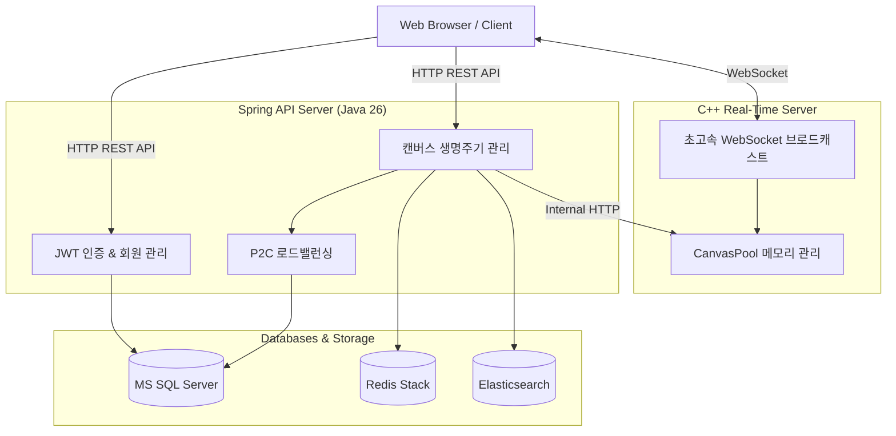
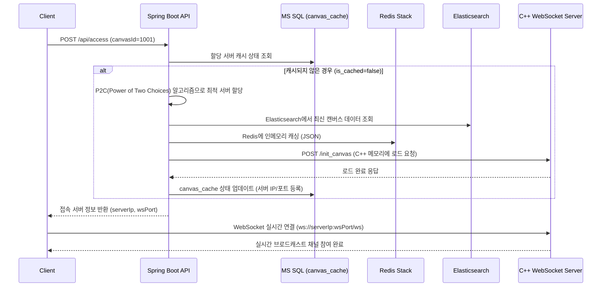

# Project Agora Backend (BE)

[](LICENSE)
[](https://openjdk.org/)
[](https://spring.io/projects/spring-boot)
[](https://en.cppreference.com/)

**Project Agora**의 대규모 실시간 동시 협업 캔버스 백엔드 시스템입니다.  
Java Spring Boot 기반의 비즈니스 로직·인증·로드밸런싱 계층과 C++ 기반 초고성능 WebSocket 실시간 이벤트 브로드캐스트 엔진 계층으로 분리되어 있으며, MS SQL Server, Redis Stack, Elasticsearch와 긴밀히 연동되어 고성능 분산 캐싱과 영구 데이터 동기화를 보장합니다.

---

## 목차 (Table of Contents)

1. [시스템 아키텍처 개요](#1-시스템-아키텍처-개요)
2. [기술 스택](#2-기술-스택)
3. [핵심 기능 및 라이프사이클](#3-핵심-기능-및-라이프사이클)
4. [데이터베이스 및 인프라 설정 가이드](#4-데이터베이스-및-인프라-설정-가이드)
5. [주요 API 명세](#5-주요-api-명세)
6. [실시간 인터랙티브 테스트베드 (JSP)](#6-실시간-인터랙티브-테스트베드-jsp)
7. [빌드, 테스트 및 실행 가이드](#7-빌드-테스트-및-실행-가이드)
8. [오픈소스 라이선스 및 규정 준수 고지](#8-오픈소스-라이선스-및-규정-준수-고지)

---

## 1. 시스템 아키텍처 개요

### 시스템 전체 흐름도



### 서버 간 네트워크 구성도

```
                       [ Web Browser / Client ]
                                  │
          ┌───────────────────────┴───────────────────────┐
          │ (HTTP REST / JSP)                             │ (WebSocket :8001)
          ▼                                               ▼
┌─────────────────────────┐                     ┌─────────────────────────┐
│   Spring Boot Server    │   Internal HTTP     │    C++ Real-Time Server │
│   (Java 26 / Port 8080) │────────────────────>│    (uWebSockets / :8000)│
│                         │<────────────────────│                         │
│  - JWT 인증 및 회원 관리    │  Lifecycle Cleanup  │  - CanvasPool 메모리 관리  │
│  - P2C 로드밸런싱          │   (User Count: 0)   │  - 초고속 WS 브로드캐스트    │
│  - 캔버스 라이프사이클       │                     │  - 실시간 세션/채널 추적     │
└──────────┬──────────────┘                     └────────────┬────────────┘
           │                                                 │
     ┌─────┴────────────────────────┐                        │
     ▼                              ▼                        ▼
┌──────────────────┐      ┌──────────────────┐      ┌──────────────────┐
│  MS SQL Server   │      │  Elasticsearch   │      │   Redis Stack    │
│  (Users/Cache/   │      │  (캔버스 문서 영구   │      │  (인메모리 캐시,    │
│   Servers/Redis) │      │   보관 및 검색)     │      │   JSON & Search) │
└──────────────────┘      └──────────────────┘      └──────────────────┘
```

- **Spring Boot API Server (`spring/`)**: REST API 제공, 회원 관리, JWT 토큰 발급, 캔버스 메타데이터 제어, 서버 및 Redis 인스턴스 풀 관리(P2C 알고리즘), 데이터 스토리지 간 동기화 오케스트레이션.
- **C++ WebSocket Server (`cpp/`)**: uWebSockets 및 uSockets 기반 이벤트 기반 비동기 I/O. 캔버스별 메모리 풀(`CanvasPool`)과 소켓 채널(`SocketChannel`)을 유지하며 참여자 간 메시지를 제로카피급 속도로 실시간 브로드캐스트.
- **MS SQL Server**: `users`, `server_info`, `redis_info`, `canvas_cache` 테이블을 관리하여 영구 메타데이터와 현재 캐시 배정 상태 추적.
- **Redis Stack**: RedisJSON을 이용해 실시간 캔버스 데이터를 빠른 인메모리 포맷으로 유지.
- **Elasticsearch**: 캔버스의 전체 이력 및 검색 가능한 문서를 영구 보관.

---

## 2. 기술 스택

### Backend & Real-Time Engine
- **Java**: OpenJDK 26
- **Framework**: Spring Boot 4.1.1, Spring Data JPA, Spring Security, Apache Tomcat Embed (JSP Engine)
- **C++**: C++17, uWebSockets, uSockets, cpp-httplib, FreeTDS (`sybdb`), zlib, nlohmann/json
- **Database & Storage**: MS SQL Server 2022, Redis Stack (RedisJSON / RediSearch), Elasticsearch 8.15.0
- **Security & Tokens**: JJWT (0.12.6), BCrypt Password Encoder
- **Build Tools**: Gradle 8.x (Java), CMake 3.16+ (C++)

---

## 3. 핵심 기능 및 라이프사이클

### (1) 캔버스 초기 생성 및 상태
- 최초 캔버스 생성 시 MS SQL의 `canvas_cache`에 등록되며 기본값은 다음과 같습니다:
  - `is_cached = false`
  - `redis_ip = null`, `redis_port = null`
  - `server_ip = null`, `server_port = null`

### (2) 클라이언트 접속 진입 (`POST /api/access`)



1. 클라이언트가 캔버스 ID로 접속 요청.
2. Spring Boot가 **P2C (Power of Two Choices)** 알고리즘을 통해 부하가 가장 적은 C++ 서버와 Redis 인스턴스를 선정.
3. Redis에 캔버스 데이터가 없으면 Elasticsearch에서 문서를 조회하여 Redis에 캐싱.
4. C++ 서버의 `/init_canvas` 엔드포인트를 호출하여 C++ 메모리 풀(`CanvasPool`)에 캔버스를 로드.
5. MS SQL `canvas_cache`의 캐시 상태 갱신: `is_cached = true`, `server_ip`, `server_port`, `redis_ip`, `redis_port`.
6. 클라이언트에게 할당된 WebSocket 접속 정보(`server_ip`, `ws_port`) 및 포트 정보 반환.

### (3) 실시간 협업 및 미세 변경 반영 (`PATCH /api/canvases/{canvasId}/granular`)
- 캔버스 속성이나 세부 필드가 변경되면 Redis와 Elasticsearch에 반영함과 동시에, C++ 서버의 `/update_canvas`를 호출하여 현재 채널에 접속 중인 모든 웹소켓 클라이언트에게 델타 변경점을 실시간 브로드캐스트합니다.

### (4) 활성 사용자 0명 자동 해제 (Teardown & Cleanup Lifecycle)
1. **웹소켓 닫힘 감지**: C++ WebSocket 서버에서 클라이언트의 연결이 종료되면 해당 캔버스의 활성 연결 수를 즉시 검사.
2. **Java API 자동 통지**: 캔버스 내 활성 사용자가 0명이 되면 C++ 서버가 백그라운드 비동기로 Spring Boot의 `POST /api/canvases/cleanup/user-count-zero` 엔드포인트를 호출.
3. **C++ 메모리 해제**: C++ `CanvasPool`에서 캔버스를 언로드하여 서버 리소스 회수.
4. **Redis -> Elasticsearch 최종 동기화**: Redis에 남아있는 최신 캔버스 JSON 데이터를 Elasticsearch에 저장하여 데이터 유실 방지.
5. **MS SQL 상태 복원**: MS SQL `canvas_cache` 테이블의 레코드를 업데이트:
   - `is_cached = false`
   - `server_ip = 'none'`, `server_port = 'none'`
   - `redis_ip = 'none'`, `redis_port = 'none'`

---

## 4. 데이터베이스 및 인프라 설정 가이드

### 설정 파일 위치
- Spring: [spring/src/main/resources/application.properties](file:///home/ubuntu/github/project-agora-BE/spring/src/main/resources/application.properties)
- C++ Server: 실행 시 커맨드라인 인자로 포트 및 IP 지정 (`./agora_cpp_server 127.0.0.1 203.0.113.50 8000 8002`)
- Nginx: 리버스 프록시 및 SSL 설정 (`nginx/agora.conf`)

### MS SQL 접속 환경 변수 매핑
요구사항에 따라 **데이터베이스 IP와 포트를 손쉽게 분리 변경**할 수 있도록 설계되었습니다:

| 항목 | 설정 프로퍼티 (`application.properties`) | 환경 변수 | 기본값 |
| :--- | :--- | :--- | :--- |
| **DB IP (호스트)** | `app.db.host` | `DB_HOST` | `127.0.0.1` |
| **DB 포트** | `app.db.port` | `DB_PORT` | `1433` |
| **DB 이름** | `app.db.name` | `DB_NAME` | `agora_db` |
| **DB 사용자** | `app.db.username` | `DB_USER` | `agora_user` |
| **DB 비밀번호** | `app.db.password` | `DB_PASSWORD` | `YourStrongPassword!1234` |

### Elasticsearch 접속 설정

| 항목 | 설정 프로퍼티 | 환경 변수 | 기본값 |
| :--- | :--- | :--- | :--- |
| **ES 호스트** | `app.elasticsearch.host` | `ES_HOST` | `127.0.0.1` |
| **ES 포트** | `app.elasticsearch.port` | `ES_PORT` | `9200` |

### UTF-8 문자 인코딩 및 다국어(한글) 처리 구성
시스템 전반(설정 파일, DB 커넥션, 엔티티, HTTP 서블릿)에서 한글 깨짐(Mojibake) 현상을 원천 방지하도록 UTF-8 표준 인코딩이 통합 적용되어 있습니다:

1. **`.properties` 파일 UTF-8 로더 (`Utf8PropertiesPropertySourceLoader`)**:
   - Java 표준 및 Spring Boot 기본 프로퍼티 로더는 `.properties` 파일을 `ISO-8859-1`로 해석하여 한글이 깨지는 문제가 있습니다.
   - Spring SPI를 통해 [Utf8PropertiesPropertySourceLoader](file:///home/ubuntu/github/project-agora-BE/spring/src/main/java/com/endpoint/frelog/global/config/Utf8PropertiesPropertySourceLoader.java)를 최우선 순위(`Ordered.HIGHEST_PRECEDENCE`)로 등록하여 `application.properties`의 설정값(예: `app.admin.nickname=아고라관리자`)을 유니코드 이스케이프(`\uXXXX`) 없이도 순수 UTF-8로 안전하게 로드합니다.
2. **MS SQL JDBC 유니코드 전송 및 JPA `@Nationalized`**:
   - [DataSourceConfig.java](file:///home/ubuntu/github/project-agora-BE/spring/src/main/java/com/endpoint/frelog/global/config/DataSourceConfig.java)의 JDBC URL에 `;sendStringParametersAsUnicode=true;useUnicode=true;characterEncoding=UTF-8` 파라미터를 강제 적용하여 문자열이 `NVARCHAR` 규격으로 전송됩니다.
   - JPA 엔티티 [User.java](file:///home/ubuntu/github/project-agora-BE/spring/src/main/java/com/endpoint/frelog/domain/user/entity/User.java)의 `nickname`, `email` 등 다국어 필드에 `@org.hibernate.annotations.Nationalized`가 명시되어 있어 MS SQL 유니코드 컬럼과 완벽하게 호환됩니다.
3. **HTTP 요청/응답 서블릿 UTF-8 강제**:
   - `server.servlet.encoding.charset=UTF-8`, `server.servlet.encoding.force=true` 설정을 통해 모든 HTTP API 응답 및 예외 처리(Error Response) 메시지의 캐릭터셋을 UTF-8로 보장합니다.

---

## 5. 주요 API 명세

### (1) 회원 및 인증 API (Spring Boot)
- **회원가입**: `POST /api/auth/signup`
  - **Input (Body)**: `{"email": "...", "password": "...", "nickname": "..."}`
  - **Output (201 Created)**: `UserResponse` 객체 (하단 참고)
- **로그인**: `POST /api/auth/login`
  - **Input (Body)**: `{"email": "...", "password": "..."}`
  - **Output (200 OK)**: `{"tokenType": "Bearer", "accessToken": "<JWT>", "user": {UserResponse}}`
- **내 정보 조회**: `POST /api/auth/me`
  - **Input (Body)**: `{"token": "<JWT>"}`
  - **Output (200 OK)**: `UserResponse` 객체
- **회원 단건 조회**: `GET /api/users/{nickname}/{tagNumber}`
  - **Input (Path)**: `nickname`, `tagNumber` (헤더에 어드민 또는 본인 JWT 필요)
  - **Output (200 OK)**: `UserResponse` 객체
- **회원 정보 수정**: `PUT/PATCH /api/users/{nickname}/{tagNumber}`
  - **Input (Path)**: `nickname`, `tagNumber` (헤더에 어드민 또는 본인 JWT 필요)
  - **Output (200 OK)**: `UserResponse` 객체
- **회원 탈퇴(삭제)**: `DELETE /api/users/{nickname}/{tagNumber}`
  - **Input (Path)**: `nickname`, `tagNumber` (헤더에 어드민 또는 본인 JWT 필요)
  - **Output (204 No Content)**: 없음 (상태만 WITHDRAWN 변경 후 닉네임 난독화, 웹소켓 강제 종료)

> **※ `UserResponse` 구조 예시:**
> `{"email": "test@agora.com", "nickname": "홍길동", "tag_number": 1, "role": "ROLE_USER", "status": "ACTIVE", "created_at": "...", "updated_at": "..."}`

### (2) 캔버스 관리 및 접속 API (Spring Boot)
- **캔버스 생성**: `POST /api/canvases`
  - **Input (Body)**: `{"canvas_name": "...", "canvas_password": "...", "init_group": "..."}`
  - **Output (201 Created)**: `CanvasResponse` 객체 (`{"canvasId": 1, "canvasName": "...", "createdAt": "...", ...}`)
- **전체 목록 조회**: `GET /api/canvases`
  - **Output (200 OK)**: `[CanvasSummaryResponse]` 배열 (`[{"canvas_id": 1, "canvas_name": "...", "user_count": 0, "description": "...", "image": "..."}]`)
- **단건 조회**: `GET /api/canvases/{canvasId}`
  - **Input (Path)**: `canvasId`
  - **Output (200 OK)**: `CanvasSummaryResponse` 객체
- **캔버스 삭제**: `DELETE /api/canvases/{canvasId}`
  - **Input (Path)**: `canvasId`
  - **Output (204 No Content)**: 없음 (DB, ES, Redis에서 영구 삭제. 단, 현재 활성화(캐시) 상태인 캔버스는 삭제 거부)
- **접속 진입 (로드밸런싱)**: `POST /api/canvases/{canvasId}/access`
  - **Input (Path)**: `canvasId` (헤더 JWT 인증)
  - **Output (200 OK)**: `{"server_id": 1, "ws_port": "8080"}`
  - *참고: P2C 알고리즘 기반으로 최적의 C++ 서버와 Redis를 할당받고, 내부적으로 C++ 서버에 토큰을 등록(`POST /api/auth/token`)합니다.*

### (3) 인프라 관리 및 로드밸런서 API (Spring Boot / ADMIN 전용)
- **할당 테스트**: `POST /api/load-balancer/allocate/server`
  - **Input**: 없음 (어드민 인증 필요)
  - **Output (200 OK)**: `{"serverId": 1, "address": "10.0.0.1", "port": 8000}` (P2C 로직 수동 검증)

### (4) C++ 실시간 통신 제어 API (Internal REST :8000)
> 주로 Spring Boot 서버가 내부적으로(Internal) 호출하여 C++ 서버의 메모리를 제어하는 용도입니다.
- **토큰 등록**: `POST /api/auth/token`
  - **Input (Body)**: `{"user_id": 1, "token": "<JWT>"}`
  - **Output (200 OK)**: 없음 (웹소켓 연결 전 사전 인증 등록)
- **사용자 강제 퇴장**: `POST /api/users/{userId}/disconnect`
  - **Input (Path)**: `userId`
  - **Output (204 No Content)**: 없음
- **특정 캔버스 사용자 퇴장**: `POST /api/canvas/{canvasId}/users/{userId}/disconnect`
  - **Input (Path)**: `canvasId`, `userId`
  - **Output (204 No Content)**: 없음
- **메모리 강제 해제**: `DELETE /api/canvas/{canvasId}`
  - **Input (Path)**: `canvasId`
  - **Output (204 No Content)**: 없음
- **모니터링 및 부하 확인**: `GET /api/canvas/count`, `GET /api/canvas/active`, `GET /health`
  - **Output**: 각각 활성 유저 수(`200 OK, {"count": 10}`), 활성 캔버스 목록(`200 OK, {"active_canvases": [...]}`), 서버 헬스체크(`204 No Content`) 반환

### (5) 실시간 웹소켓 엔드포인트 (Nginx WSS)
- **접속 주소**: `wss://<Domain_or_IP>/ws/canvas/{canvasId}?token=<JWT>&user_id=<ID>`
  - **Input (Query Params)**: `token`, `user_id`
  - **Output**: 성공 시 웹소켓 연결 수립
- **특징**: 보안을 위해 Nginx 리버스 프록시와 SSL(`wss://`)을 거쳐 내부 C++ 웹소켓 포트(`127.0.0.1:8002`)로 포워딩됩니다. 연결 과정과 쿼리 스트링의 토큰은 네트워크 상에 노출되지 않으며 안전하게 C++ 서버에서 검증됩니다.

---

## 6. 실시간 인터랙티브 테스트베드 (JSP)

브라우저에서 Agora 백엔드의 전체 파이프라인과 웹소켓 브로드캐스트를 직관적으로 테스트할 수 있는 내장 테스트베드를 제공합니다.

- **접속 URL**:
  - `https://<Domain_or_IP>/test`
  - Nginx가 포트 443(HTTPS)으로 받은 후 `127.0.0.1:8080`으로 라우팅합니다.
- **테스트베드 기능**:
  1. **인증 관리**: 원클릭 테스트 계정 로그인 및 JWT 발급 상태 표시.
  2. **서버 & Redis 인스턴스 관리**: C++ 서버 및 Redis 정보 등록/조회.
  3. **캔버스 라이프사이클 테스트**:
     - 캔버스 생성 -> Access 진입(P2C 서버 할당) -> Granular 수정 -> 활성 사용자 0명 자동 해제 검증.
  4. **듀얼 웹소켓 브로드캐스트 검증 (Dual WebSocket Clients)**:
     - **클라이언트 A**와 **클라이언트 B**를 독립적으로 연결.
     - 클라이언트 A에서 전송한 메시지가 C++ 웹소켓 서버를 거쳐 클라이언트 B로 정상 브로드캐스트되는지 양방향 패킷 로그로 실시간 확인.
     - Ping / Pong 응답 지연 시간(ms) 실시간 측정.

---

## 7. 빌드, 테스트 및 실행 가이드

### (1) Java Spring Boot Server

```bash
cd spring

# 1. 전체 단위 및 통합 테스트 실행 (CanvasServiceTest 등 30+ 테스트)
./gradlew test

# 2. 실행 가능한 Jar 파일 빌드
./gradlew bootJar

# 3. 개발 서버 실행 (포트 8080)
./gradlew bootRun

# (선택) 환경 변수를 통한 DB 호스트 변경 실행 예시
DB_HOST=127.0.0.1 DB_PORT=1433 ./gradlew bootRun
```

### (2) C++ Real-Time Server

```bash
cd cpp

# 1. 빌드 디렉터리 생성 및 CMake 구성
cmake -B build -S .

# 2. 빌드 실행 (uSockets 및 agora_cpp_server 컴파일)
cmake --build build

# 3. 서버 실행 (포트 8000 REST, 포트 8002 WebSocket 수신)
# 사용법: ./build/agora_cpp_server [BIND_IP] [ADVERTISE_IP] [REST_PORT] [WS_PORT]
# (보안을 위해 외부 직접 노출을 막고 Nginx를 통한 접속만 허용하도록 BIND_IP는 127.0.0.1 사용을 권장합니다)
./build/agora_cpp_server 127.0.0.1 127.0.0.1 8000 8002
```

### (3) Nginx 리버스 프록시 (SSL 적용 및 외부망 보호)

웹 서버인 Nginx는 클라이언트의 모든 HTTPS 요청을 가로채어 적절한 내부 백엔드 서버(Spring Boot 또는 C++ Server)로 포워딩합니다.

```bash
# Nginx 설정 파일 문법 검증 및 서비스 재기동
sudo nginx -t
sudo systemctl reload nginx
```
**주요 역할:**
- **포트 바인딩 보호**: Spring Boot(`127.0.0.1:8080`)와 C++ 서버(`127.0.0.1:8000`, `127.0.0.1:8002`)는 로컬에서만 띄워 외부 공격을 차단합니다.
- **REST & 정적 라우팅**: `/api/` 및 `/` 경로에 대한 접근을 모두 Spring Boot 8080 포트로 중계합니다.
- **웹소켓(WSS) 라우팅**: `/ws/` 에 대한 통신은 C++ 웹소켓 서버(8002)로 Upgrade 하여 터널을 뚫어줍니다.

---

## 8. 오픈소스 라이선스 및 규정 준수 고지

`Project Agora Backend`는 **MIT License**로 배포됩니다.  
본 프로젝트는 다양한 오픈소스 소프트웨어(OSS) 라이브러리를 포함하고 있으며, 각 라이브러리의 라이선스 규정을 엄격히 준수합니다.

상세한 라이선스 전문 및 고지 사항은 [THIRD_PARTY_LICENSES.md](THIRD_PARTY_LICENSES.md) 및 [LICENSE](LICENSE) 파일에서 확인할 수 있습니다.

### 주요 외부 라이브러리 및 라이선스 요약

| 라이브러리 / 컴포넌트 | 적용 영역 | 라이선스 | 저작권자 |
| :--- | :--- | :--- | :--- |
| **uWebSockets** | C++ 실시간 웹소켓 서버 | Apache-2.0 | Alex Hultman |
| **uSockets** | C++ 비동기 네트워킹 코어 | Apache-2.0 | Alex Hultman |
| **cpp-httplib** | C++ HTTP 통신 | MIT | Yuji Hirose |
| **nlohmann/json** | C++ JSON 직렬화 | MIT | Niels Lohmann |
| **FreeTDS (`sybdb`)** | C++ MSSQL DB 클라이언트 (동적 링크) | LGPL-2.1+ | Brian Bruns & FreeTDS Contributors |
| **zlib** | C++ 패킷 압축 | zlib | Jean-loup Gailly, Mark Adler |
| **Spring Boot & Framework** | Java 애플리케이션 프레임워크 | Apache-2.0 | VMware, Inc. / Broadcom |
| **Microsoft JDBC Driver for SQL Server** | Java MSSQL 커넥터 | MIT | Microsoft Corporation |
| **JJWT (`jjwt`)** | Java JWT 토큰 처리 | Apache-2.0 | Les Hazlewood & Contributors |
| **Jackson Databind** | Java JSON 프로세서 | Apache-2.0 | FasterXML, LLC |
| **Apache Tomcat Embed** | Java 서블릿/JSP 컨테이너 | Apache-2.0 | Apache Software Foundation |
| **Jakarta Servlet / JSTL API** | Java 웹 표준 인터페이스 | EPL-2.0 | Eclipse Foundation |
| **Pretendard / Inter / Fira Code** | 테스트베드 웹 폰트 | SIL OFL 1.1 | Kil Hyung-jin, Rasmus Andersson, Nikita Prokopov |

> [!NOTE]
> **LGPL v2.1 고지 (FreeTDS `sybdb`)**: 본 소프트웨어는 FreeTDS 라이브러리를 동적 링크(`libsybdb.so`) 방식으로 사용하며, FreeTDS의 소스 코드는 공식 웹사이트([https://www.freetds.org/](https://www.freetds.org/))에서 언제든지 확인 및 취득할 수 있습니다.
