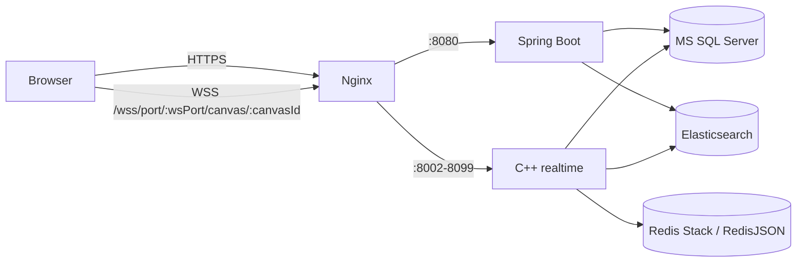

# Project Agora BE

Project Agora의 애플리케이션 및 실시간 협업 서버입니다. Spring Boot는 인증, 캔버스 메타데이터, 서버 할당을 담당하고 C++ 서버는 WebSocket 연결과 실시간 이벤트를 처리합니다.

저장소 인프라는 [Project Agora DB](../project-agora-DB)에서 실행합니다.

## 구성



| 구성 요소 | 역할 | 기본 바인딩 |
| --- | --- | --- |
| `spring/` | REST API, JWT, 사용자·캔버스 관리, 서버 할당 | `127.0.0.1:8080` |
| `cpp/` | C++ REST 제어 API, uWebSockets 실시간 이벤트 | `127.0.0.1:8000`, `127.0.0.1:8002` |
| `nginx/` | HTTPS/WSS 역방향 프록시 | `:443` |
| MS SQL Server | 계정, 세션, 캔버스 배정, 서버 메타데이터 | `127.0.0.1:1433` |
| Redis Stack | 활성 캔버스 RedisJSON 문서와 RediSearch 색인 | `127.0.0.1:6379` |
| Elasticsearch | 캔버스 문서 영구 저장소 | `127.0.0.1:9200` |

## 캔버스 접속 흐름

1. 사용자는 `POST /api/auth/login`으로 일반 JWT를 받습니다.
2. `POST /api/canvases/{canvasId}/access`가 heartbeat와 REST health check를 통과한 C++ 서버를 선택하고, 캔버스 전용 JWT를 발급합니다.
3. 클라이언트는 응답의 `ws_port`를 사용해 `wss://<host>/wss/port/{wsPort}/canvas/{canvasId}?token=...`에 연결합니다.
4. C++ 서버는 JWT, 사용자 상태, 참여자 목록을 검증한 뒤 RedisJSON에서 캔버스를 로드합니다. 이전 문자열 Redis 값은 첫 로드 시 RedisJSON으로 마이그레이션됩니다.
5. 항목 이벤트는 권한 그룹에 따라 전달되고 RedisJSON에 저장됩니다. 마지막 사용자가 나가면 Redis 문서를 Elasticsearch에 저장한 뒤 캐시 배정을 해제합니다.

C++ 서버는 5초마다 `cpp_server.last_heartbeat_at`을 갱신합니다. Spring은 15초 이내 heartbeat와 `/health` 응답을 모두 만족한 서버만 재사용합니다.

## 사전 요구 사항

- JDK 26
- CMake 3.16 이상, C++17 컴파일러, `pkg-config`
- `cpp-httplib`, `nlohmann-json3`, OpenSSL, FreeTDS (`sybdb`), zlib 개발 패키지
- Docker 및 Docker Compose v2
- Project Agora DB의 MS SQL Server, Redis Stack, Elasticsearch
- TLS 인증서와 Nginx (외부 WSS 제공 시)

Ubuntu 환경에서는 제공되는 스크립트를 통해 위 종속성들을 한번에 설치할 수 있습니다:

```bash
chmod +x install_dependencies.sh
./install_dependencies.sh
```

## 환경 변수

운영 비밀값은 Git에 넣지 않습니다. 프로젝트 루트의 `.env`를 만들고 권한을 제한합니다.

```bash
cd /path/to/project-agora-BE
umask 077
cat > .env <<'EOF'
DB_HOST=127.0.0.1
DB_PORT=1433
DB_NAME=agora_db
DB_USER=agora_user
DB_PASSWORD=<mssql-application-password>

JWT_SECRET=<32자-이상의-무작위-공유-키>
ADMIN_PASSWORD=<초기-관리자-비밀번호>

ES_HOST=127.0.0.1
ES_PORT=9200
ES_INDEX=canvas
ES_USER_NAME=agora_user
ES_USER_PASSWORD=<elasticsearch-application-password>

REDIS_USER=agora_user
REDIS_USER_PASSWORD=<redis-application-password>
EOF
chmod 600 .env
```

`JWT_SECRET`은 Spring과 모든 C++ 인스턴스가 반드시 같은 값을 사용해야 합니다. `ADMIN_PASSWORD`는 사용자가 아직 하나도 없을 때만 초기 관리자 생성에 사용됩니다. DB 저장소의 `MSSQL_PASSWORD`, `ES_USER_PASSWORD`, `REDIS_USER_PASSWORD`와 BE의 해당 값은 일치해야 합니다.

## 로컬 실행

먼저 DB 저장소에서 인프라를 준비합니다.

```bash
cd /path/to/project-agora-DB
docker compose up -d
./mssql/init-mssql.sh
./redis/init-redis.sh
./elasticsearch/init-elasticsearch.sh
```

Spring과 C++ 서버를 빌드합니다.

```bash
cd /path/to/project-agora-BE
set -a
source ./.env
set +a

./spring/gradlew -p spring bootJar
cmake -S cpp -B cpp/build
cmake --build cpp/build -j2
```

Spring 서버를 실행합니다.

```bash
java -jar spring/build/libs/frelog-0.0.1-SNAPSHOT.jar
```

다른 터미널에서 C++ 서버를 실행합니다.

```bash
cd /path/to/project-agora-BE
set -a
source ./.env
set +a

./cpp/build/agora_cpp_server 127.0.0.1 127.0.0.1 8000 8002
```

명령 인자는 `BIND_IP ADVERTISE_IP REST_PORT WS_PORT` 순서입니다. 위 구성은 C++ 포트를 로컬에만 열고 Nginx가 외부 HTTPS/WSS 트래픽을 전달합니다. 다중 C++ 인스턴스는 포트를 겹치지 않게 지정합니다. Nginx 예시 설정은 `8002`부터 `8099`의 WS 포트만 전달합니다.

## systemd 운영 예시

```ini
# /etc/systemd/system/agora-spring.service
[Unit]
Description=Project Agora Spring API
After=network-online.target docker.service

[Service]
User=ubuntu
WorkingDirectory=/path/to/project-agora-BE
EnvironmentFile=/path/to/project-agora-BE/.env
ExecStart=/usr/bin/java -jar /path/to/project-agora-BE/spring/build/libs/frelog-0.0.1-SNAPSHOT.jar
Restart=on-failure

[Install]
WantedBy=multi-user.target
```

```ini
# /etc/systemd/system/agora-cpp.service
[Unit]
Description=Project Agora C++ Realtime Server
After=network-online.target docker.service agora-spring.service
Requires=agora-spring.service

[Service]
User=ubuntu
WorkingDirectory=/path/to/project-agora-BE/cpp
EnvironmentFile=/path/to/project-agora-BE/.env
ExecStart=/path/to/project-agora-BE/cpp/build/agora_cpp_server 127.0.0.1 127.0.0.1 8000 8002
Restart=on-failure

[Install]
WantedBy=multi-user.target
```

```bash
sudo systemctl daemon-reload
sudo systemctl enable --now agora-spring agora-cpp
```

## Nginx와 WSS

[nginx/agora.conf.example](nginx/agora.conf.example) 파일에는 Spring Boot API 프록시와 C++ 포트별 WSS 라우팅이 통합된 전체 Nginx 설정 예시가 포함되어 있습니다.

Nginx 환경 설정과 로컬 SSL 구성은 다음 명령어로 빠르게 세팅할 수 있습니다:

```bash
# Nginx 설치 및 자체 서명 인증서(Local 테스트용) 생성
sudo apt-get install -y nginx
mkdir -p nginx/ssl
openssl req -x509 -nodes -days 365 -newkey rsa:2048 \
  -keyout nginx/ssl/key.pem -out nginx/ssl/cert.pem \
  -subj "/C=KR/ST=Seoul/L=Seoul/O=Project Agora/OU=Dev/CN=localhost"

# Nginx 환경 설정 적용
sudo cp nginx/agora.conf.example /etc/nginx/sites-available/agora.conf
sudo ln -sf /etc/nginx/sites-available/agora.conf /etc/nginx/sites-enabled/agora.conf
sudo rm -f /etc/nginx/sites-enabled/default
sudo systemctl restart nginx
```

WSS 주소는 다음 형식을 사용합니다.

```text
wss://<domain>/wss/port/<wsPort>/canvas/<canvasId>?token=<canvasAccessToken>
```

이전 `/wss/server/...` 형식은 사용하지 않습니다. WSS 포트 범위를 제한해 역방향 프록시가 임의 내부 포트 프록시가 되지 않도록 합니다.

## 주요 API

보호 API에는 `Authorization: Bearer <accessToken>` 헤더가 필요합니다.

| 목적 | 메서드·경로 | 인증 |
| --- | --- | --- |
| 회원가입 | `POST /api/auth/signup` | 없음 |
| 로그인 | `POST /api/auth/login` | 없음 |
| 인증 상태 확인 | `GET /api/auth/health` | 없음 |
| 캔버스 생성 | `POST /api/canvases` | 필요 |
| 캔버스 목록·검색 | `GET /api/canvases`, `GET /api/canvases/search?name=` | 필요 |
| 캔버스 조회·삭제 | `GET`, `DELETE /api/canvases/{canvasId}` | 필요 |
| 캔버스 접속 정보 발급 | `POST /api/canvases/{canvasId}/access` | 필요 |
| 서버·Redis 할당 점검 | `/api/load-balancer/**` | 관리자 |
| C++ health | `GET http://127.0.0.1:8000/health` | 내부 |
| C++ 활성 캔버스 | `GET http://127.0.0.1:8000/api/canvas/active` | 내부 |

접속 응답 예시:

```json
{
  "server_id": 5,
  "ws_port": "8002",
  "canvas_access_token": "<websocket-token>"
}
```

`/api/test/cpp-active-canvases`와 관련 테스트 프록시는 등록되어 있고 heartbeat가 최신인 C++ 서버만 조회합니다.

## 테스트와 점검

```bash
# Spring 단위·통합 테스트
./spring/gradlew -p spring test

# C++ 빌드
cmake -S cpp -B cpp/build
cmake --build cpp/build -j2

# 서버 상태
curl http://127.0.0.1:8080/api/auth/health
curl http://127.0.0.1:8000/health
curl http://127.0.0.1:8000/api/canvas/active
```

DB·RedisJSON·Elasticsearch CRUD 및 권한 테스트는 DB 저장소에서 실행합니다.

```bash
cd /path/to/project-agora-DB
python3 tests/test_storages.py
```

## 저장소 구조

```text
spring/       Spring Boot API와 정적 테스트 페이지
cpp/          C++ REST·WebSocket 서버
nginx/        TLS/WSS 프록시 예시
```

## 라이선스

이 프로젝트는 [MIT License](LICENSE)를 따릅니다. 외부 라이브러리 고지는 [THIRD_PARTY_LICENSES.md](THIRD_PARTY_LICENSES.md)에서 확인할 수 있습니다.
