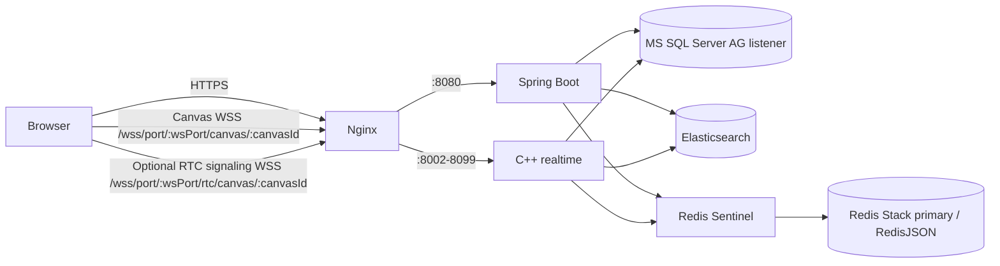

# Project Agora BE

Project Agora의 애플리케이션 및 실시간 협업 서버입니다. Spring Boot는 인증, 캔버스 메타데이터, 서버 할당을 담당하고 C++ 서버는 WebSocket 연결과 실시간 이벤트를 처리합니다.

저장소 인프라는 [Project Agora DB](../project-agora-DB)에서 실행합니다.

## 구성


```mermaid
flowchart LR
    Browser[Browser] -->|HTTPS| Nginx
    Browser -->|Canvas WSS /wss/port/:wsPort/canvas/:canvasId| Nginx
    Browser -->|Optional RTC signaling WSS /wss/port/:wsPort/rtc/canvas/:canvasId| Nginx
    Nginx -->|:8080| Spring[Spring Boot]
    Nginx -->|:8002-8099| Cpp[C++ realtime]
    Spring --> MSSQL[(MS SQL Server AG listener)]
    Spring --> ES[(Elasticsearch)]
    Spring --> Sentinel[Redis Sentinel]
    Cpp --> MSSQL
    Cpp --> Sentinel
    Sentinel --> Redis[(Redis Stack primary / RedisJSON)]
    Cpp --> ES
```

| 구성 요소 | 역할 | 기본값·예시 |
| --- | --- | --- |
| `spring/` | REST API, JWT, 사용자·캔버스 관리, 서버 할당 | `127.0.0.1:8080` |
| `cpp/` | C++ REST 제어 API, uWebSockets 실시간 이벤트 | 기본 `HOST=0.0.0.0`, REST `8000`, WS `8002`; 아래 운영 예시는 loopback 바인드 |
| `nginx/` | HTTPS/WSS 역방향 프록시 | `:443` |
| MS SQL Server AG listener | 계정, 세션, 캔버스 배정, 서버 메타데이터 | 로컬 `127.0.0.1:1433`; 운영에서는 listener DNS/VIP |
| Redis Stack HA | 활성 캔버스 RedisJSON 문서와 RediSearch 색인 | 필수 Sentinel seed로 현재 primary 탐색 |
| Elasticsearch | 캔버스 문서 영구 저장소 | `127.0.0.1:9200` |

## 캔버스 접속 흐름

1. 사용자는 `POST /api/auth/login`으로 일반 JWT를 받습니다.
2. `POST /api/canvases/{canvasId}/access`가 캔버스 비밀번호를 확인하고 DB heartbeat 및 C++ `GET /api/canvas/count` 확인을 통과한 서버 중 실시간 활성 캔버스 수가 적은 서버를 선택한 뒤 설정 revision을 담은 캔버스 전용 JWT를 발급합니다. 참여 권한 확인은 C++ WebSocket 연결 시 수행합니다.
3. 클라이언트는 응답의 `ws_port`를 사용해 캔버스 WebSocket에 연결합니다. 이 연결 하나가 캔버스 이벤트의 송신과 수신을 모두 처리합니다.
4. C++ 서버는 JWT를 확인한 뒤 캐시 할당이나 세션 예약 전에 Redis/Elasticsearch에서 참여자와 설정 revision을 한 번 검증합니다. 통과한 경우에만 사용자 세션을 예약하고 캔버스를 로드합니다. 로드 직후에는 참여자 권한을 재검사하지 않고 revision만 비교해 확인과 로드 사이의 설정 변경을 막습니다.
5. 항목 이벤트는 권한 그룹을 확인한 뒤 RedisJSON에 저장됩니다. 항목 변경은 다른 캔버스 접속자에게 실시간 브로드캐스트하지 않으며, 최신 상태는 재접속 후 `init_items`에서 받습니다. 마지막 사용자가 나가면 Redis 문서를 Elasticsearch에 저장한 뒤 캐시 배정을 해제합니다.

일반 캔버스 이벤트의 전체·그룹 브로드캐스트와 임의 payload relay는 제공하지 않습니다. 설정 변경 알림(`canvas_settings_changed`)은 유지되고, RTC는 별도 신호 채널에서 피어 상태를 알리거나 지정된 피어 한 명에게 신호를 전달합니다. 정상 종료 때는 저장을 마친 뒤 각 연결에 재접속 신호를 보냅니다.

WebRTC를 사용할 때 클라이언트는 별도의 RTC 신호 WebSocket도 엽니다. 캔버스와 RTC 신호 연결은 같은 `ws_port`를 쓰지만 서로 다른 URL 경로와 독립된 WebSocket 연결입니다. 캔버스 WebSocket의 `init_items.rtc_canvas_connection_id`와 `rtc_canvas_connection_hash`를 RTC 신호 연결의 `rtc_join` 이벤트에 함께 보내면 서버가 해시를 검증한 뒤 해당 캔버스 WebSocket과 RTC 피어를 연결합니다. 피어 목록과 신호 대상은 캔버스별로 분리됩니다. 캔버스 WebSocket이 닫히면 그 연결에 묶인 RTC 피어만 즉시 해제하며 RTC 신호 WebSocket은 열린 상태로 남습니다. `rtc_disconnect`도 피어 등록만 해제하고 RTC 신호 WebSocket을 닫지 않습니다. 두 경우 모두 실제 WebRTC 연결을 닫는 것은 클라이언트의 책임입니다. `user_sessions`와 캔버스 활성 상태는 캔버스 WebSocket만 기준으로 갱신됩니다. C++ 서버는 SDP와 ICE 정보만 지정 피어에게 전달하며 실제 WebRTC 미디어·데이터 패킷을 경유시키지 않습니다. 외부 TURN 사용 여부는 클라이언트의 ICE 설정에 달려 있습니다.

캔버스 이벤트는 하나의 양방향 WebSocket으로 송수신합니다. 과거 RX/TX TCP 소켓 구현은 제거되었습니다.

C++ 서버는 5초마다 `cpp_server.last_heartbeat_at`을 갱신합니다. Spring은 최근 15초 heartbeat를 후보 필터로 사용하고, 서버의 실시간 활성 캔버스 수는 C++ `GET /api/canvas/count`에서 조회해 할당 부하로 사용합니다. 다른 C++ 제어 API는 Spring에서 호출하지 않습니다.

## 사전 요구 사항

- JDK 26
- CMake 3.16 이상, C++17 컴파일러, `pkg-config`
- `cpp-httplib`, `nlohmann-json3`, OpenSSL, FreeTDS (`sybdb`), zlib 개발 패키지
- Docker 및 Docker Compose v2
- Project Agora DB의 MS SQL Server, Redis Stack, Elasticsearch
- TLS 인증서와 Nginx (외부 WSS 제공 시)

Ubuntu 환경에서는 제공되는 스크립트를 통해 위 종속성들을 한번에 설치할 수 있습니다:

```bash
chmod +x install_dependencies.sh
# Oracle이 공개한, 내려받을 JDK 아카이브와 정확히 일치하는 SHA-256을 지정합니다.
JDK_SHA256=<official-sha256> ./install_dependencies.sh
```

설치 스크립트는 SHA-256이 주어지지 않으면 JDK를 설치하지 않습니다. `latest` URL을 사용할 때는 Oracle의 해당 아카이브 체크섬을 매 실행 전에 확인해야 합니다. 운영 환경에서는 고정된 JDK URL과 그 SHA-256을 함께 지정하는 것을 권장합니다.

## 환경 변수

운영 비밀값은 Git에 넣지 않습니다. 프로젝트 루트의 `.env`를 만들고 권한을 제한합니다.

```bash
cd /path/to/project-agora-BE
umask 077
cat > .env <<'EOF'
DB_HOST=127.0.0.1
DB_PORT=1433
DB_NAME=agora_db
DB_USER=agora_user
DB_PASSWORD=<mssql-application-password>
# 로컬 단일 노드는 false, 운영 AG listener는 true를 사용합니다.
DB_MULTI_SUBNET_FAILOVER=false

JWT_SECRET=<32바이트-이상의-무작위-공유-키>
CPP_INTERNAL_API_TOKEN=<Spring과 C++ REST 내부 호출용 32바이트-이상의-무작위-키>
ADMIN_PASSWORD=<초기-관리자-비밀번호>

ES_HOST=127.0.0.1
ES_PORT=9200
ES_SCHEME=http
ES_CA_CERT=
ES_INDEX=canvas
ES_USER_NAME=agora_user
ES_USER_PASSWORD=<elasticsearch-application-password>
ES_LOG_INDEX=agora-logs
ES_LOG_USER_NAME=agora_log_writer
ES_LOG_USER_PASSWORD=<elasticsearch-log-writer-password>

# Optional: flush the bounded Elasticsearch log queue in batches.
ES_LOG_BATCH_SIZE=100
ES_LOG_FLUSH_INTERVAL_MS=1000
HA_FAILOVER_MONITOR_INTERVAL_MS=10000

REDIS_USER=agora_user
REDIS_USER_PASSWORD=<redis-application-password>
# 로컬 HA Compose에서는 같은 Docker 호스트의 내부 사설 주소를 지정합니다.
# 운영에서는 BE 호스트에서 도달 가능한 사설 Sentinel 주소를 사용합니다.
# 단일 Redis 개발 환경은 비워 두고 DB에 등록된 endpoint를 사용합니다.
REDIS_SENTINELS=172.20.0.6:26379,172.20.0.3:26379,172.20.0.4:26379
REDIS_SENTINEL_MASTER_NAME=agora-master
REDIS_SENTINEL_USER=
REDIS_SENTINEL_PASSWORD=
REDIS_TLS_ENABLED=true
REDIS_TLS_CA_CERT=/etc/agora/certs/redis-ca.crt

# Production C++ FreeTDS config (strict TLS, CA and hostname validation).
DB_ENCRYPT=true
DB_TRUST_SERVER_CERTIFICATE=false
DB_FREETDS_CONF=/etc/freetds/freetds.conf

# 브라우저에서 별도 프론트엔드 도메인으로 API를 호출할 때만 지정합니다.
# 여러 도메인은 쉼표로 구분합니다. 같은 도메인에서 제공하면 비워 둡니다.
CORS_ALLOWED_ORIGINS=https://app.example.com
EOF
chmod 600 .env
```

`JWT_SECRET`은 Spring과 모든 C++ 인스턴스가 반드시 같은 값을 사용해야 하며 UTF-8 기준 최소 32바이트가 필요합니다. 양쪽은 캔버스 JWT에 HS256 서명을 사용합니다. `ADMIN_PASSWORD`는 사용자가 아직 하나도 없을 때만 초기 관리자 생성에 사용됩니다. DB 저장소의 `MSSQL_PASSWORD`, `ES_USER_PASSWORD`, `ES_LOG_USER_PASSWORD`, `REDIS_USER_PASSWORD`와 BE의 해당 값은 일치해야 합니다. 캔버스 문서는 `ES_USER_NAME`/`ES_USER_PASSWORD`, 운영 로그는 별도 `ES_LOG_USER_NAME`/`ES_LOG_USER_PASSWORD` 계정을 사용합니다.

`CPP_INTERNAL_API_TOKEN`은 Spring에서 C++ REST 관리 API를 호출할 때 보내는 내부 Bearer 성격의 공유 토큰입니다. 최소 32바이트의 무작위 값을 사용하세요. C++ `/api/**` 경로는 이 값이 맞지 않으면 요청을 거부하며, Docker Compose는 `.env` 전체를 컨테이너에 전달하지 않고 각 서비스가 필요한 환경 변수만 전달합니다.

C++ 캐시는 캔버스별 `Poco::LRUCache`에 아이템 문서를 저장합니다. `CPP_CANVAS_LRU_ITEMS_PER_CANVAS`는 캔버스 하나당 보관할 아이템 수이며 기본값은 64, 최대값은 4096입니다. 0으로 설정하면 아이템 캐시를 끕니다. `CPP_CANVAS_LRU_CAPACITY`는 프로세스가 유지할 캔버스별 캐시 수이며 기본값은 256, 최대값은 4096입니다. 새 아이템은 Redis에 먼저 만들며 생성 요청에서 바로 캐시하지 않습니다. 첫 조회는 요청된 경로만 Redis에서 읽고, 반복 조회로 자주 사용되는 아이템만 전체 문서로 LRU에 승격합니다. LRU에 들어 있는 아이템은 조회와 변경을 캐시 사본 기준으로 수행합니다. 변경 사본은 dirty 상태로 보관하며 LRU에서 밀려나거나 명시적으로 동기화하거나 캔버스를 반환·종료할 때 전체 아이템을 Redis에 기록해 Redis의 이전 값을 덮어씁니다. 동기화 실패 시 dirty 사본을 버리지 않고 캔버스 반환을 중단합니다. 삭제는 Redis에 반영된 뒤 LRU에서도 제거합니다. 전체 캔버스 조회는 dirty LRU 사본을 Redis 문서에 합쳐 최신 데이터를 반환합니다. 한 아이템이 256 KiB를 넘으면 캐시에 두지 않으며, 채팅 기록 배열도 크기 변동이 커 Redis에서 직접 읽습니다. 채팅방 메타데이터를 flush할 때는 Redis의 기록 배열을 보존합니다.

운영 HA 설정에서는 `DB_HOST`/`DB_PORT`를 각 SQL 노드가 아닌 AG listener에 맞추고 `DB_MULTI_SUBNET_FAILOVER=true`를 설정합니다. Spring JDBC는 listener를 통해 읽기/쓰기 primary에 연결하며 풀은 끊긴 연결을 폐기하고 새 연결을 만듭니다. C++ FreeTDS 연결 풀도 끊긴 연결을 버리고 listener에 새 연결을 최대 3회, 짧은 backoff로 엽니다. 두 경로 모두 이미 전송한 SQL 쓰기/트랜잭션을 자동 재실행하지 않습니다. 응답이 불명확한 쓰기는 호출자에게 실패로 돌려보내고, 애플리케이션 요청 수준에서 안전성을 판단하도록 합니다.

모든 환경은 `REDIS_SENTINELS`에 Sentinel 주소(운영 구성 기준 3개, 포트 `26379`)를 지정하고 master 이름은 `agora-master`로 둡니다. Spring 설정과 C++ 클라이언트는 Sentinel seed 없이 시작하지 않으며 DB의 `redis_server.redis_ip`/`redis_port`로 직접 연결하는 fallback은 없습니다. C++은 CA를 검증하는 TLS로 Sentinel에서 현재 primary를 찾고, Redis 노드의 `ROLE`이 `master`인지 확인한 뒤 ACL 계정으로 연결합니다. `REDIS_TLS_ENABLED=true`와 컨테이너에서 읽을 수 있는 `REDIS_TLS_CA_CERT`를 설정하고, 인증서 SAN에는 Sentinel seed와 Sentinel이 반환하는 Redis 주소를 포함해야 합니다. SQL에는 HA 서비스 행 하나를 활성화하고, 이 행의 IP/포트는 호환을 위한 논리 식별 주소입니다. failover 후 기존 `redis_id` 배정은 유지됩니다. 저장소의 standalone Redis Compose는 제거했습니다. 운영에서는 앱 호스트에서 사설망으로 Sentinel `26379`와 Redis `6379`에 접근할 수 있도록 제한하고 TLS를 유지합니다.

Redis Sentinel 전환 중 Spring의 캔버스 접근 확인은 최신 RedisJSON 문서를 읽을 때까지 제한된 재탐색을 수행하고, 읽지 못하면 fail-closed로 재시도를 요청합니다. C++도 기본적으로 실패한 Redis 쓰기를 자동 재전송하지 않아 중복 저장을 방지합니다. Redis 복제는 비동기이므로 failover 직전의 확인된 쓰기가 새 primary에 없을 수 있습니다. 캔버스 캐시 키가 사라졌거나 DB의 캐시 상태와 맞지 않으면 Elasticsearch 내용을 자동으로 복구해 진행하지 않고 요청을 실패시킵니다.

Spring Boot의 SLF4J/Logback 애플리케이션 로그와 C++ 서버의 stdout/stderr 로그를 별도 `ES_LOG_INDEX`에 저장합니다. 여기에 SQL listener 연결 끊김·복구와 primary 인스턴스 변경, Redis 연결 불가·복구와 Sentinel primary 변경 이벤트도 구조화해 추가합니다. 각 문서는 `@timestamp`, 레코드별 `event_id`, `service`, `instance`, `environment`, `version`, `component`, `event`, `level`, `message`를 가집니다. 요청 흐름에는 공통 `request_id`, 처리 작업 `operation`, 결과 `outcome`, HTTP 상태 또는 `error_code`/`error_type`이 추가됩니다. HTTP 로그에는 메서드·경로·상태·처리 시간, WebSocket 로그에는 캔버스·사용자·메시지 유형이 들어갑니다. 경로는 query string을 제외해 JWT와 토큰이 로그에 남지 않습니다.

Spring과 C++ REST는 `X-Request-ID`를 전달하며, 누락되거나 안전한 형식이 아니면 서버가 새 ID를 생성해 응답 헤더에도 반환합니다. Spring 캔버스 접근 요청 ID는 서명된 접속 JWT의 `requestId` claim으로 C++ WebSocket 연결 로그에 이어집니다. WebSocket 클라이언트는 각 메시지에 `request_id`를 포함하며, 비동기 Redis 저장 로그에도 같은 ID가 유지되고 오류·결과 응답은 가능한 경우 같은 ID를 돌려줍니다. 접속 요청에서 시작한 메시지는 `parent_request_id`로도 묶입니다. 로그 수준은 Spring Logback 수준과 HTTP/WebSocket 결과에 따라 `INFO`, `WARN`, `ERROR`로 기록합니다.

두 서버는 쓰기 전용 로그 계정으로 문서를 `create` 방식으로 추가하며 로그 조회나 기존 문서 수정은 하지 않습니다. Spring과 C++은 각각 최대 100건 또는 1초 주기로 로그를 모아 Elasticsearch `_bulk` 요청 한 번으로 전송합니다. 조정에는 `ES_LOG_BATCH_SIZE`와 `ES_LOG_FLUSH_INTERVAL_MS`를 사용하고, Spring SQL 상태 점검 주기는 `HA_FAILOVER_MONITOR_INTERVAL_MS`로 설정합니다. Elasticsearch에 연결할 수 없는 동안 큐는 최대 10,000건이며, 초과한 새 로그는 버려지고 로컬 로그에 경고가 남습니다.

Spring JDBC는 기본적으로 TLS 인증서 검증을 사용합니다. C++ FreeTDS는 `DB_FREETDS_CONF`에 `encryption = strict`, CA 파일, 호스트명 검증을 설정해야 합니다. 검증 가능한 인증서를 구성할 수 없는 개발 환경에서만 `DB_TRUST_SERVER_CERTIFICATE=true`를 지정하고 운영에서는 설정하지 마세요.

비밀 저장소를 파일로 마운트하면 Spring은 `/run/secrets/`의 파일을 프로퍼티로 읽습니다(예: `DB_PASSWORD`, `JWT_SECRET`, `ES_LOG_USER_PASSWORD`). Spring config tree 파일은 값 끝의 개행도 비밀번호에 포함하므로 파일 생성 시 개행을 추가하지 마세요(예: `printf %s "$SECRET" > /run/secrets/DB_PASSWORD`). C++은 DB·Redis·Sentinel·Elasticsearch 비밀번호에서 `<VARIABLE>_FILE`을 지원하고 파일 끝의 CR/LF를 제거합니다(예: `DB_PASSWORD_FILE=/run/secrets/DB_PASSWORD`). 직접 설정한 환경변수가 있으면 파일보다 우선합니다.

Elasticsearch HTTPS를 쓸 때 `ES_SCHEME=https`, `ES_CA_CERT`를 Elasticsearch 인증서의 CA 파일로 설정합니다. C++과 Spring은 인증서 체인과 호스트 이름을 검증하고, 검증에 실패하면 연결하지 않습니다.

`ES_CA_CERT`와 `REDIS_TLS_CA_CERT`는 백엔드 프로세스 사용자에게 파일 읽기와 상위 디렉터리 탐색 권한이 있어야 합니다. 로컬 DB 저장소의 개발 인증서는 저장소 내부 권한이 제한될 수 있으므로 CA 공개 인증서만 이 저장소의 Git 제외 디렉터리 `.local-certs/`에 복사해 사용합니다. 개인 키가 있는 인증서 디렉터리의 권한을 넓히지 마세요. 운영에서는 공개 CA 인증서를 백엔드 컨테이너의 읽기 전용 secret 경로로 마운트합니다.

## Docker로 백엔드 실행

`docker-compose.backend.yml`은 Spring과 C++ 백엔드 컨테이너만 관리합니다. DB 저장소 루트의 기본 `docker compose up`은 SQL Server·Elasticsearch·Redis Sentinel HA를 시작합니다. 같은 Docker 엔진에서 DB와 백엔드는 `agora-net` 및 `agora-redis-ha` 네트워크 이름으로 연결됩니다. 두 네트워크는 겹치지 않는 고정 서브넷을 사용합니다. 컨테이너 이름과 네트워크가 준비되면 Docker DNS가 자동으로 이름을 찾으므로, 별도 네트워크 설정 파일을 백엔드에 복사할 필요는 없습니다. DB 환경 파일의 계정·Sentinel 주소가 바뀌면 백엔드 `.env`에도 반영한 뒤 컨테이너를 재생성해야 합니다. 아래 시작 스크립트가 DB 볼륨을 확인하고, 이전 Sentinel Compose 프로젝트에서 전환이 필요한 경우 기존 HA 볼륨을 보존하며 프로젝트를 옮긴 뒤 연결값을 동기화합니다. Elasticsearch가 healthy가 된 뒤 인덱스 또는 로그 alias가 없으면 스키마를 초기화하고, 캔버스·로그 계정과 역할을 동기화한 다음 Spring을 시작합니다.

백엔드 Compose는 프로젝트 루트 `.env`의 `ES_CA_CERT`와 `REDIS_TLS_CA_CERT`를 호스트의 CA 파일 경로로 사용해 컨테이너에 읽기 전용으로 마운트합니다. 컨테이너 안에서는 각각 `/run/certs/elasticsearch-ca.crt`, `/run/certs/redis-ca.crt`로 참조합니다. TLS 연결을 위해 Elasticsearch는 HTTPS, Redis/Sentinel은 TLS를 사용하며 `REDIS_SENTINELS`에는 세 Sentinel 주소를 설정해야 합니다. 이미지에는 `.env`나 인증서를 복사하지 않습니다.

운영 환경에서 C++ SQL TLS 인증서 검증을 사용할 때 Docker 컨테이너 경로는 `DOCKER_DB_FREETDS_CONF=/etc/freetds/freetds.conf`로 설정합니다. `DB_TRUST_SERVER_CERTIFICATE=false`이면 기본 FreeTDS 설정이 TLS를 강제하고 OS 신뢰 저장소와 서버 호스트명을 검증합니다. OS 신뢰 저장소에 없는 SQL CA를 쓸 때는 `CPP_SQL_CA_CERT_HOST_PATH`로 호스트 CA 파일을 마운트하고, `CPP_FREETDS_CONF_HOST_PATH`가 가리키는 FreeTDS 설정에서 `/run/certs/sql-ca-bundle.crt`를 `ca file`로 지정합니다. 로컬 자체 서명 DB에서만 `DB_TRUST_SERVER_CERTIFICATE=true`를 사용하세요. 이 설정은 TLS 암호화를 유지하면서 자체 서명 인증서 검증만 건너뛰는 개발용 FreeTDS 설정을 자동 선택합니다.

로컬 단일 Docker 엔진에서 DB와 백엔드를 함께 실행할 때는 아래 스크립트가 MSSQL·Elasticsearch를 올리고 health를 기다린 다음 기본 Redis Sentinel HA를 준비합니다. 기존 standalone 컨테이너나 데이터 볼륨이 남아 있으면 데이터를 자동으로 버리지 않고 RDB 이관 안내와 함께 멈춥니다. 레거시 데이터를 HA로 옮긴 뒤 다시 실행하면 retired 컨테이너를 제거하고 Redis HA ACL·색인·단일 `redis_server` 등록을 적용합니다. 이어 DB 계정과 Sentinel 주소를 백엔드 `.env`에 동기화한 뒤 백엔드를 시작합니다. `.env`는 소유자 전용 권한(`0600`)으로 다시 씁니다. 스크립트는 SQL·Elasticsearch 데이터 볼륨이 있는지도 확인하며 누락된 볼륨을 빈 데이터로 새로 만들지 않습니다. 최초 실행 전 SQL 스키마와 Elasticsearch 계정은 초기화되어 있어야 합니다.

```bash
cd /path/to/project-agora-BE
./scripts/start-docker-stack.sh
```

이 스크립트는 DB와 백엔드가 같은 Docker 엔진을 쓸 때만 사용합니다. 별도 Docker 호스트에서는 Docker bridge 네트워크와 컨테이너 이름이 호스트 간에 공유되지 않으므로, DB 서버의 도달 가능한 사설 IP/DNS를 `DOCKER_DB_HOST`, `DOCKER_ES_HOST`, `REDIS_SENTINELS`에 설정하고 Redis 노드가 사설망 주소를 광고하도록 구성해야 합니다. 이 경우 각 호스트에서 해당 호스트용 Compose를 시작하고, 백엔드 호스트의 네트워크·방화벽 및 인증서 SAN을 별도로 맞춰야 합니다.

운영에서 비밀 관리자가 환경값을 주입하는 구성에는 이 로컬 동기화 스크립트를 사용하지 마세요. 운영의 DB 주소·CA·비밀값은 각 서버의 비밀 관리 및 다중 호스트 배포 설정으로 공급합니다.

이 백엔드 Compose는 `agora-redis-primary`와 세 Sentinel을 검사하고 `agora-redis-ha` 네트워크의 Sentinel 주소를 사용합니다. DB 저장소의 루트 Compose는 primary·replica·Sentinel HA 구성만 시작합니다. 예전 standalone 컨테이너를 제거해 호스트 포트 `6379`나 Redis Insight 포트 `8001` 충돌 경로도 구성에서 없앴습니다.

```bash
cd /path/to/project-agora-DB
# One-time transition when upgrading from the previous project-agora-db-ha stack
./ops/migrate-local-redis-ha.sh
docker compose up -d
docker compose ps
```

```bash
cd /path/to/project-agora-BE
./scripts/backend-docker.sh config
./scripts/backend-docker.sh build  # 선택 사항: up 명령이 이미지도 빌드합니다.
./scripts/backend-docker.sh up
./scripts/backend-docker.sh health
```

`up`은 `agora-net`, `agora-redis-ha` 네트워크와 MSSQL·Elasticsearch·Redis primary/replica/Sentinel 컨테이너들의 health 상태를 확인하고, Spring을 먼저 준비한 뒤 C++을 시작합니다. 의존 컨테이너가 없거나 아직 healthy 상태가 아니면 구체적인 컨테이너를 표시하고 중단합니다. DB 스택이 Docker 네트워크를 교체해 기존 백엔드 컨테이너가 사라진 네트워크 ID를 참조하면, 스크립트가 백엔드 컨테이너를 새 네트워크에 다시 연결합니다. Compose 파일에서 `DOCKER_DB_HOST`와 `DOCKER_ES_HOST`의 기본값은 `agora-mssql`, `agora-elasticsearch`입니다. 다른 네트워크 주소나 AG listener를 쓸 때는 `.env`에 `DOCKER_DB_HOST`/`DOCKER_DB_PORT`, `DOCKER_ES_HOST`/`DOCKER_ES_PORT`를 지정하세요. SQL 인증서 검증을 사용하는 환경에서는 DB 주소가 SQL 인증서 SAN과 일치해야 합니다.

컨테이너는 non-root 사용자로 실행하고 root 파일시스템을 읽기 전용으로 둡니다. Spring 캔버스 이미지는 `agora-backend-spring-resources` 볼륨에 저장되어 컨테이너를 재생성해도 유지됩니다. Spring API는 호스트 `127.0.0.1:8080`, C++ REST API는 `127.0.0.1:8000`, C++ WebSocket은 `127.0.0.1:8002`에만 게시합니다. Spring은 컨테이너 내부에서 `0.0.0.0:8080`에 바인딩하고, C++은 DB에 `agora-cpp` 주소를 등록해 같은 Docker 네트워크의 Spring이 호출할 수 있도록 합니다. 현재 Nginx 예시는 호스트 loopback 포트들을 프록시합니다. `backend-docker.sh`는 `agora-net`의 Docker 게이트웨이를 C++의 `CPP_TRUSTED_PROXY_IPS`로 전달해, 신뢰한 호스트 프록시의 `X-Real-IP`만 접속 JWT의 IP 확인에 사용합니다. 직접 `docker compose`로 백엔드만 시작할 때는 `CPP_TRUSTED_PROXY_IPS`에 해당 네트워크의 게이트웨이 주소를 지정해야 합니다.

```bash
./scripts/backend-docker.sh status
./scripts/backend-docker.sh logs spring
./scripts/backend-docker.sh logs cpp
./scripts/backend-docker.sh restart  # 이미지 재빌드 없이 컨테이너를 재생성
./scripts/backend-docker.sh stop
./scripts/backend-docker.sh start
./scripts/backend-docker.sh down    # 백엔드 컨테이너만 제거; DB와 볼륨은 유지
```

소스 변경을 이미지에 반영할 때는 `./scripts/backend-docker.sh up`을 다시 실행합니다. `.env`나 Docker 설정을 바꿨을 때도 Compose가 컨테이너를 재생성합니다. `logs`는 계속 출력되므로 `Ctrl+C`를 눌러도 컨테이너는 중지되지 않습니다. 서버 health API는 `http://127.0.0.1:8080/api/auth/health`와 `http://127.0.0.1:8000/health`입니다.

## 로컬 실행

먼저 DB 저장소에서 인프라를 준비합니다.

```bash
cd /path/to/project-agora-DB
docker compose up -d
./mssql/init-mssql.sh
./redis/init-redis.sh
./elasticsearch/init-elasticsearch.sh
```

이 Docker Compose는 DB·Redis·Elasticsearch 인프라를 시작합니다. Spring과 C++ 백엔드는 이 저장소에서 별도 프로세스로 실행합니다. DB가 이미 초기화된 뒤 단순히 백엔드를 다시 시작할 때는 DB 저장소에서 `docker compose up -d`만 실행하면 됩니다. 초기화 스크립트 사용 시점과 상태 확인은 [DB 저장소 안내](../project-agora-DB/README.md)를 따르세요.

로컬 MSSQL 컨테이너는 자체 서명 인증서를 사용하므로, 로컬 개발 `.env`에만 `DB_TRUST_SERVER_CERTIFICATE=true`를 설정합니다. 운영 DB에서는 CA 검증이 되는 인증서를 구성하고 이 값을 설정하지 마세요.

Spring과 C++ 서버를 빌드합니다.

```bash
cd /path/to/project-agora-BE
set -a
source ./.env
set +a

./spring/gradlew -p spring bootJar
cmake -S cpp -B cpp/build
cmake --build cpp/build -j2
```

Spring 서버를 실행합니다.

```bash
cd /path/to/project-agora-BE
bash spring/run-local.sh
```

이 명령은 Spring을 현재 터미널의 전경 프로세스로 실행합니다. 실행 중인 터미널을 로그 확인용으로 열어 두세요. 스크립트가 프로젝트 루트 `.env`를 읽으므로 별도로 `source`할 필요가 없습니다.

로컬 실행 스크립트가 프로젝트 루트의 `.env`를 불러오고 `JWT_SECRET`이 설정됐는지 확인한 뒤, 빌드 JAR의 임시 사본으로 서버를 시작합니다. 따라서 실행 중 `bootJar`를 다시 빌드해도 기존 서버가 참조하는 JAR이 바뀌지 않습니다. 새 코드를 적용하려면 서버를 재시작해야 합니다. 운영 환경에서는 기존처럼 서비스 관리자가 환경변수를 주입해야 합니다.

프로젝트 루트에서 `java -jar spring/build/libs/frelog-0.0.1-SNAPSHOT.jar`를 직접 실행해도 Spring이 같은 `.env`를 읽습니다. 다른 디렉터리에서 실행할 때는 실행 스크립트를 사용하세요.

`java -jar`로 빌드 디렉터리의 JAR을 직접 실행 중이라면 해당 파일을 다시 빌드하지 마세요. 재빌드 후에는 기존 프로세스를 종료하고 새 JAR로 재시작하세요. 실행 중 JAR을 덮어쓰면 `/css/**` 같은 정적 파일이 404로 응답할 수 있습니다.

다른 터미널에서 C++ 서버를 실행합니다.

```bash
cd /path/to/project-agora-BE
set -a
source ./.env
set +a

./cpp/build/agora_cpp_server 127.0.0.1 127.0.0.1 8000 8002
```

명령 인자는 `BIND_IP ADVERTISE_IP REST_PORT WS_PORT` 순서입니다. 위 구성은 C++ 포트를 로컬에만 열고 Nginx가 외부 HTTPS/WSS 트래픽을 전달합니다. 바이너리는 `HOST`를 지정하지 않으면 `0.0.0.0`에 바인드하므로, 이 운영 예시처럼 loopback만 허용하려면 인자 또는 `HOST=127.0.0.1`로 지정합니다. 다중 C++ 인스턴스는 포트를 겹치지 않게 지정합니다. Nginx 예시 설정은 `8002`부터 `8099`의 WS 포트만 전달합니다.

### 실행 확인, 중지, 재시작

Spring과 C++을 각각 실행한 뒤 두 health API가 HTTP 200을 반환하는지 확인합니다.

```bash
curl -fsS http://127.0.0.1:8080/api/auth/health
curl -fsS http://127.0.0.1:8000/health
```

각 명령은 서비스 상태가 정상이면 JSON 응답을 출력합니다. 포트 사용 여부는 다음처럼 확인할 수 있습니다.

```bash
ss -ltnp | rg ':(8080|8000|8002)\b'
```

터미널에서 실행한 서버를 종료할 때는 해당 서버 터미널에서 `Ctrl+C`를 누릅니다. C++은 `SIGINT`/`SIGTERM`을 받으면 새 접속을 먼저 막고 저장 큐를 처리한 뒤 로드된 캔버스 문서를 Elasticsearch에 저장합니다. 그 다음 인증된 각 WebSocket에 `{"type":"server_reconnect","reason":"server_shutdown","retry_after_ms":1000}`을 보내고 close code `1012`로 닫습니다. Elasticsearch 저장에 실패한 문서는 저장에 성공하기 전까지 Redis에서 삭제하지 않으며, 종료 과정에서 다시 저장을 시도할 수 있습니다. 종료 절차는 저장 실패가 있어도 계속됩니다. 코드 변경을 적용하려면 Spring 또는 C++ 프로세스를 종료한 뒤 빌드 명령을 다시 실행하고 해당 서버를 다시 시작합니다. C++ 서버를 재시작하면 DB의 서버 등록과 heartbeat가 다시 수행됩니다. DB Docker 스택은 백엔드만 재시작할 때 중지할 필요가 없습니다.

터미널을 계속 열어 두기 어렵거나 부팅 후 자동 시작이 필요하면 아래 [systemd 운영 예시](#systemd-운영-예시)를 사용하세요. 임의의 `pkill` 명령으로 Java나 C++ 프로세스를 종료하면 다른 실행 인스턴스까지 영향을 줄 수 있으므로, 로컬 전경 실행은 `Ctrl+C`, systemd 실행은 `systemctl`로 관리합니다.

채팅은 `items[room_id]`의 `chat_room` 아이템으로 관리됩니다. 메시지는 해당 아이템의 `data` 배열에 방별 순번과 함께 저장되며, `{"type":"chat","room_id":"general","text":"test"}` 이벤트로 보냅니다. 서버는 요청한 소켓에만 응답하고 다른 참여자에게 실시간 브로드캐스트하지 않습니다. 각 참여자는 `chat_history` 이벤트의 `limit` 또는 `from_sequence`/`to_sequence`로 저장된 내역을 조회할 수 있습니다. WebSocket 공개 이벤트에는 내부 DB `user_id`나 `sender_id`를 포함하지 않습니다. 캔버스 권한·세션 처리에는 내부 사용자 ID를 서버에서만 사용합니다.

캔버스 설정은 비활성 상태에서는 Spring REST API로, 활성 상태에서는 C++ 서버의 `canvas_settings_get`/`canvas_settings_update` 이벤트로 변경합니다. 활성 캔버스에 Spring 수정 요청을 보내면 `409 CANVAS_006`과 접속 후 설정에서 변경하라는 안내를 반환합니다. WebSocket 변경에는 최신 `settings_revision`을 `expected_revision`으로 보내야 하며, 충돌 시 `SETTINGS_CONFLICT`가 반환됩니다. C++ 서버는 캐시 할당과 세션 예약 전에 Redis 또는 Elasticsearch 문서에서 참여자와 revision을 확인하고, 설정 업데이트에서는 사용자 활성 상태·서버 할당·참여자·`admin-group` 권한을 검사합니다. 성공한 설정 변경은 Redis와 Elasticsearch에 즉시 반영되며, Elasticsearch 업데이트는 설정 필드만 패치해 실시간 아이템을 덮어쓰지 않습니다. 성공하면 요청자에게 `canvas_settings_result`를 보내고, 요청자를 제외한 현재 인증된 참여자에게 비밀번호 해시가 없는 `canvas_settings_changed` 알림을 전송합니다. 비밀번호는 Spring에서 BCrypt, C++에서 PBKDF2-HMAC-SHA256 해시로 저장되며 평문이나 해시는 WebSocket 응답에 포함되지 않습니다. 접속 토큰은 설정 revision에 묶여 변경 전 발급된 토큰은 새 연결에 사용할 수 없습니다.

## systemd 운영 예시

systemd는 백엔드를 터미널과 분리해 실행하고 재부팅 후 자동 시작하도록 구성할 때 사용합니다. 먼저 DB Docker 서비스가 실행 중이고, Spring JAR과 C++ 바이너리를 빌드했는지 확인하세요. 아래 예시의 `User`, 저장소 경로, `.env` 경로는 실제 서버에 맞게 바꾸고 `.env`에는 예시 값이 아닌 유효한 설정을 입력합니다. `.env`는 `User`로 지정한 서비스 계정이 읽을 수 있게 소유자와 권한을 설정하세요(예: 서비스 계정 소유, `0600`). `EnvironmentFile`은 shell 스크립트가 아니므로 `export`, 명령 치환, shell 변수 확장을 넣지 말고 `KEY=value` 형식을 사용하세요.

```ini
# /etc/systemd/system/agora-spring.service
[Unit]
Description=Project Agora Spring API
After=network-online.target docker.service

[Service]
User=ubuntu
WorkingDirectory=/path/to/project-agora-BE
EnvironmentFile=/path/to/project-agora-BE/.env
ExecStart=/usr/bin/java -jar /path/to/project-agora-BE/spring/build/libs/frelog-0.0.1-SNAPSHOT.jar
Restart=on-failure

[Install]
WantedBy=multi-user.target
```

```ini
# /etc/systemd/system/agora-cpp.service
[Unit]
Description=Project Agora C++ Realtime Server
After=network-online.target docker.service agora-spring.service
Requires=agora-spring.service

[Service]
User=ubuntu
WorkingDirectory=/path/to/project-agora-BE/cpp
EnvironmentFile=/path/to/project-agora-BE/.env
ExecStart=/path/to/project-agora-BE/cpp/build/agora_cpp_server 127.0.0.1 127.0.0.1 8000 8002
Restart=on-failure

[Install]
WantedBy=multi-user.target
```

```bash
sudo systemctl daemon-reload
sudo systemctl enable agora-spring agora-cpp
sudo systemctl start agora-spring
sudo systemctl start agora-cpp
sudo systemctl status --no-pager agora-spring agora-cpp

# 로그 확인
sudo journalctl -u agora-spring -u agora-cpp -f

# 순차 중지·재시작
sudo systemctl stop agora-cpp agora-spring
sudo systemctl start agora-spring
sudo systemctl start agora-cpp

# 또는 두 백엔드 재시작
sudo systemctl restart agora-spring agora-cpp
```

`enable`은 서버 재부팅 후 자동 시작을 설정하고, `start`는 지금 서버를 시작합니다. `agora-cpp`는 Spring API를 사용하므로 Spring을 먼저 시작합니다. DB Compose는 이 unit에 포함되지 않으므로 DB 저장소의 Docker 서비스가 먼저 준비되어 있어야 합니다. 각 서버의 health API도 확인합니다.

```bash
curl -fsS http://127.0.0.1:8080/api/auth/health
curl -fsS http://127.0.0.1:8000/health
```

## Nginx와 WSS

[nginx/agora.conf.example](nginx/agora.conf.example) 파일에는 Spring Boot API 프록시와 C++ 포트별 WSS 라우팅이 통합된 전체 Nginx 설정 예시가 포함되어 있습니다.

같은 Nginx 가상 호스트에서 React/Vite 프런트엔드는 Docker 컨테이너로 제공합니다. 프런트엔드 저장소의 운영 Compose가 `127.0.0.1:4173`에 컨테이너 포트를 바인딩하고, 이 Nginx 설정은 `/api/`와 `/wss/` 외의 요청을 컨테이너로 전달합니다. 컨테이너 내부 Nginx가 SPA 경로, 정적 파일, 로컬 MathJax 에셋을 처리합니다.

```bash
cd /path/to/project-agora-FE
docker compose up -d --build
docker compose ps
curl -fsS http://127.0.0.1:4173/
```

Nginx 설정을 적용하기 전 `server_name`과 인증서 경로를 배포 도메인에 맞게 바꾸세요. 자체 서명 인증서는 로컬 테스트에만 사용합니다.

```bash
# Nginx 설치 및 자체 서명 인증서(Local 테스트용) 생성
sudo apt-get install -y nginx
sudo install -d -m 700 /etc/nginx/ssl/agora
openssl req -x509 -nodes -days 365 -newkey rsa:2048 \
  -keyout /tmp/agora-privkey.pem -out /tmp/agora-fullchain.pem \
  -subj "/C=KR/ST=Seoul/L=Seoul/O=Project Agora/OU=Dev/CN=localhost"
sudo install -m 600 -o root -g root /tmp/agora-privkey.pem /etc/nginx/ssl/agora/privkey.pem
sudo install -m 644 -o root -g root /tmp/agora-fullchain.pem /etc/nginx/ssl/agora/fullchain.pem
rm -f /tmp/agora-privkey.pem /tmp/agora-fullchain.pem

# Nginx 환경 설정 적용
sudo cp nginx/agora.conf.example /etc/nginx/sites-available/agora.conf
sudo ln -sf /etc/nginx/sites-available/agora.conf /etc/nginx/sites-enabled/agora.conf
sudo nginx -t
sudo systemctl reload nginx
```

운영에서는 위의 자체 서명 인증서 대신 CA가 발급한 `fullchain.pem`과 `privkey.pem`을 `/etc/nginx/ssl/agora/`에 같은 권한으로 설치하세요. 기본 Nginx 사이트를 해제해야 한다면, 해당 사이트가 사용 중이지 않은지 확인한 뒤 별도로 처리합니다.

WSS 주소는 두 용도로 나뉘며, 둘 다 `/access` 응답의 같은 `ws_port`와 `canvas_access_token`을 사용합니다.

```text
wss://<domain>/wss/port/<wsPort>/canvas/<canvasId>?token=<canvasAccessToken>
wss://<domain>/wss/port/<wsPort>/rtc/canvas/<canvasId>?token=<canvasAccessToken>
```

첫 번째는 캔버스 이벤트 송수신용이고, 두 번째는 WebRTC 피어 등록과 SDP/ICE 신호 교환용입니다. Nginx가 URL 경로에 따라 같은 포트의 C++ WebSocket 핸들러로 전달합니다. 직접 접속할 때는 각각 `/ws/canvas/<canvasId>`와 `/ws/rtc/canvas/<canvasId>` 경로를 사용합니다. 이전 `/wss/server/...` 형식은 사용하지 않습니다. WSS 포트 범위를 제한해 역방향 프록시가 임의 내부 포트 프록시가 되지 않도록 합니다.

## 주요 API

전체 REST 및 WebSocket 요청·응답 필드는 [API_SPEC.md](API_SPEC.md)를 참조하세요.

보호 API에는 `Authorization: Bearer <accessToken>` 헤더가 필요합니다.

| 목적 | 메서드·경로 | 인증 |
| --- | --- | --- |
| 회원가입 | `POST /api/auth/signup` | 없음 |
| 로그인 | `POST /api/auth/login` | 없음 |
| 인증 상태 확인 | `GET /api/auth/health` | 없음 |
| 캔버스 생성 | `POST /api/canvases` | 필요 |
| 캔버스 목록·검색 | `GET /api/canvases`, `GET /api/canvases/search?name=` | 필요 |
| 캔버스 조회·삭제 | `GET`, `DELETE /api/canvases/{canvasId}` | 필요 |
| 캔버스 접속 정보 발급 | `POST /api/canvases/{canvasId}/access` | 필요 |
| 캔버스 설정 조회·변경 | `GET /api/canvases/{canvasId}/settings`, `PATCH /api/canvases/{canvasId}/{name,description,password}` | 참여자 조회, 비활성 캔버스 관리자 변경; 활성 상태면 C++ 설정 이벤트 사용 |
| 참여자 추가·제외 | `POST`, `DELETE /api/canvases/{canvasId}/people` (`nickname`, `tag_number` 본문) | 비활성 캔버스 관리자; 활성 상태면 캔버스에 접속해 변경 |
| 서버·Redis 할당 점검 | `/api/load-balancer/**` | 관리자 |
| C++ health | `GET http://127.0.0.1:8000/health` | 내부 |
| C++ 활성 캔버스 | `GET http://127.0.0.1:8000/api/canvas/active` | 내부 |

접속 응답 예시:

```json
{
  "server_id": 5,
  "ws_port": "8002",
  "canvas_access_token": "<websocket-token>"
}
```

비밀번호가 설정된 캔버스의 접속 요청 본문에는 `{"password":"<캔버스 비밀번호>"}`를 포함합니다. 비밀번호가 없으면 본문을 생략할 수 있습니다.

Spring은 실시간 서버 부하 확인을 위해 C++ `GET /api/canvas/count`를 호출합니다. `/api/test/cpp-active-canvases`는 DB의 `user_sessions`를 읽습니다. 활성 세션이 있는 사용자의 탈퇴나 활성 캔버스 삭제 요청은 `409` 오류로 거부되며, 기존 WebSocket 종료는 클라이언트가 처리합니다.

## 테스트와 점검

```bash
# Spring 단위·통합 테스트 (Redis 장애복구/SQL 상태감시 포함)
./spring/gradlew -p spring test

# C++ 빌드와 단위·통합 테스트 등록
cmake -S cpp -B cpp/build -DBUILD_TESTING=ON
cmake --build cpp/build -j2
ctest --test-dir cpp/build --output-on-failure

# 서버 상태
curl http://127.0.0.1:8080/api/auth/health
curl http://127.0.0.1:8000/health
curl http://127.0.0.1:8000/api/canvas/active
```

C++ 단위 테스트는 캔버스 연결 수명주기, persistence queue, 비밀번호 해시 형식을 검사합니다. C++ 통합 테스트는 loopback에 가짜 Redis Sentinel과 primary 두 개를 띄워 기존 primary의 READONLY 응답과 승격 뒤 재연결을 확인합니다. 실제 DB·Redis·Elasticsearch 서비스는 중단하거나 변경하지 않습니다.

DB·RedisJSON·Elasticsearch CRUD 및 권한 테스트는 DB 저장소에서 실행합니다.

```bash
cd /path/to/project-agora-DB
python3 tests/test_storages.py
```

## 저장소 구조

```text
spring/       Spring Boot API와 정적 테스트 페이지
cpp/          C++ REST·WebSocket 서버
nginx/        TLS/WSS 프록시 예시
```

## 라이선스

이 프로젝트는 [MIT License](LICENSE)를 따릅니다. 외부 라이브러리 고지는 [THIRD_PARTY_LICENSES.md](THIRD_PARTY_LICENSES.md)에서 확인할 수 있습니다.

C++ 실행 파일을 배포할 때는 실행 파일만 복사하지 말고 `cmake --install cpp/build --prefix <배포 경로>`로 라이선스 파일도 함께 설치하세요. Spring 실행 JAR에는 프로젝트 및 주요 외부 라이선스 고지가 포함됩니다. 운영체제 공유 라이브러리나 Docker 이미지를 별도로 묶어 배포한다면 해당 버전의 라이선스·고지도 추가로 확인해야 합니다.
