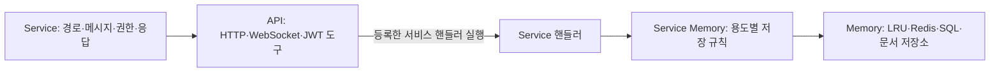

# C++ 모듈과 기능 추가

실제 HTTP·WebSocket 경로와 메시지 동작은 **Service**, 라이브러리 호출 도구는 **API**, 용도별 저장 규칙은 **Service Memory**, 범용 저장소는 **Memory**에 둡니다. 경로를 등록한 뒤의 흐름은 `Service → API의 핸들러 호출 → Service Memory → Memory`입니다. API는 서비스가 등록한 콜백을 호출하며 캔버스 클래스나 저장 규칙을 직접 알지 않습니다.



## 계층별 역할

| 디렉터리 | 역할 | 대표 클래스 |
| --- | --- | --- |
| `include/service`, `src/service` | 실제 엔드포인트·메시지 정의, 권한 검증, 업무 흐름, 응답 | `CanvasControlService`, `HealthService`, `CanvasQueryService`, `BrokerQuerySocketService`, `CanvasSettingsService`, `CanvasPersistenceService` |
| `include/api`, `src/api` | 라이브러리의 경로 등록, 요청·응답 타입, HTTPS/WSS 생성, 공통 응답 도구 | `HttpApi`, `HttpApiServer`, `BrokerSocketApi` |
| `include/service_memory`, `src/service_memory` | 저장소를 특정 용도에 맞게 사용하고 키·SQL·스냅샷 변환을 관리 | `CanvasServiceMemory`, `CanvasEventMemory`, `CanvasLifecycleMemory`, `RegistryServiceMemory`, `CanvasSnapshotMemory` |
| `include/memory`, `src/memory` | 범용 데이터 보관·조회·퇴거, Redis 명령 전송, SQL 실행, 문서 저장 | `MemoryClass`, `LruMemory<Value>`, `RedisMemory`, `RedisClient`, `MssqlMemory`, `ElasticsearchMemory` |

`BrokerQuerySocketService`는 브로커 연결·TLS 프레임·bounded worker 큐만 관리합니다. `CanvasQueryService`는 검증된 principal의 캔버스 권한 조회·CRUD·채팅·설정과 응답 계약을 정의하고 `CanvasEventMemory`와 `CanvasServiceMemory`를 사용합니다. 브라우저 사용자·RTC·호스트 상태는 Phoenix에 있습니다. [내부 WSS 계약](../../project-agora-Wall/BROKER_PROTOCOL.md)을 참고하세요.

## 메모리의 책임

`LruMemory`는 임의 키와 값만 보관하며 조회 순서에 따라 퇴거합니다. JSON·캔버스·dirty·flush·캐시 승격을 알지 않습니다. 조회 결과는 공유된 불변 값이므로 퇴거 후에도 이미 반환한 값은 유효합니다.

`RedisMemory`와 내부 드라이버 `RedisClient`는 범용 명령과 응답, Sentinel 탐색, 검증된 TLS를 담당합니다. 캔버스 키나 캐시 정책을 정의하지 않습니다. `MemoryClass`가 두 저장소를 조합하여 반복 조회 승격, dirty write-back, 삭제 무효화와 동기화를 수행합니다. Redis 저장에 실패하면 dirty 값을 보존하고 퇴거를 거절합니다. 이 클래스는 캔버스 키·채팅·서비스 환경 변수를 알지 않습니다.

참조 구조는 `CanvasServiceMemory → MemoryClass → LruMemory / RedisMemory`입니다. `CanvasServiceMemory`는 캔버스 키·아이템 경로·채팅 Lua·revision CAS를 정의하고, `initializeCanvas`에서 `CanvasSnapshotMemory`가 Elasticsearch에서 읽은 문서를 `MemoryClass`에 저장합니다. 활성 Redis 문서가 누락되면 이전 스냅샷으로 대체하지 않습니다.

다른 서비스는 `MemoryClass memory(...); memory.read("preferences:7"); memory.write("preferences:7", document);`처럼 사용합니다. 첫 조회는 Redis를 읽고 두 번째 조회에서 LRU로 승격합니다. 기본은 전체 문서 캐시이며 `Options.region_depth`로 임의의 JSON 하위 문서를 캐시할 수 있습니다. 용량과 최대 항목 크기를 넘으면 Redis를 사용합니다. `remote_fields` 콜백은 무제한 컬렉션 등의 필드를 원격 저장소에 남기며, 캔버스는 이를 이용해 채팅 이력을 제외합니다.

읽기 결과와 쓰기 동작은 캐시 유무에 관계없이 같은 인터페이스입니다. 승격된 값의 수정은 지연 저장되므로 내구성이 필요한 경계에서는 `flush(key)` 성공을 확인합니다. 캐시를 직접 조회하거나 무효화할 필요는 없습니다. 같은 백엔드에 접속하는 인스턴스만 `State`를 공유하며 기본 인스턴스는 독립 상태를 사용합니다. 캔버스 서비스는 백엔드별 상태를 공유합니다. 저장소를 이 클래스 밖에서 변경하면 캐시 일관성을 보장할 수 없으므로 원자적 Lua 연산도 `executeAtomic`을 경유합니다. 이 연산은 선행 dirty 값을 저장한 뒤 변경 경로를 무효화합니다.

기존 캔버스 용량 환경 설정은 `CanvasServiceMemory`가 `Options`로 변환합니다. 메모리 데이터 상한은 문서 수 × 문서당 항목 수 × 항목 최대 크기이며 admission 기록도 제한됩니다. 퇴거 전에 dirty 값을 저장하며 저장할 수 없으면 새 캐시 승격을 거절하고 Redis 조회 결과를 반환합니다.

`MssqlMemory`는 `SqlExecutor`를 구현하며 바인딩한 `SqlCommand`를 공용 연결 풀로 실행합니다. 스키마와 row-to-domain 변환은 `RegistryServiceMemory`에 있습니다. 할당 SQL의 트랜잭션과 잠금은 저장 규칙의 일부이므로 이 계층에서 정의합니다. 전송 계층은 결과 집합과 nullable 문자열만 반환합니다.

`ElasticsearchMemory`는 `JsonDocumentStore`를 구현하며 인덱스·문서 ID·JSON을 받아 저장합니다. 캔버스 아이템의 청크 인코딩, 복원, 비밀번호 정규화와 캔버스 ID 검색 fallback은 `CanvasSnapshotMemory`에 있습니다.

## 새 기능 추가

1. `service_memory/<Feature>Memory`에 용도별 저장 연산을 정의하고, `memory`의 범용 인터페이스를 생성자에 주입합니다. SQL 값은 `SqlCommand` 파라미터로 바인딩합니다.
2. `service/<Feature>Service`에 실제 경로·검증·응답을 정의합니다. HTTP 서비스는 `HttpServiceModule`을 구현하고 `registerRoutes(HttpApi&)`에서 경로를 등록합니다.
3. 라이브러리 기능이 더 필요하면 `api`에 범용 도구를 추가합니다. 이 도구에 기능별 경로·SQL·캔버스 키를 넣지 않습니다.
4. `main.cpp`에서 서비스와 용도별 메모리를 조립합니다. HTTP 리스너는 서비스 목록을 소유하며 서비스의 콜백이 Service Memory를 호출합니다.

```cpp
class FeatureService final : public HttpServiceModule {
public:
    explicit FeatureService(FeatureMemory& memory) : memory_(memory) {}
    void registerRoutes(HttpApi& api) override {
        api.get("/api/feature", [this](const HttpApi::Request&, HttpApi::Response& response) {
            const auto result = memory_.load();
            response.set_content(result.dump(), "application/json");
        });
    }
private:
    FeatureMemory& memory_;
};
```

## 빌드와 검증

CMake는 `agora_memory`, `agora_service_memory`, `agora_api`, `agora_service`를 각각 빌드합니다. `agora_cpp_server`는 서비스 라이브러리와 조립부를 연결합니다. `agora_observability`는 공용 로깅을 담당합니다. Poco 의존성은 제거했습니다.

기존 호스트·캔버스·캐시·Sentinel 장애 전환 테스트 외에, 주입한 저장소로 LRU 퇴거 수명, SQL 파라미터·할당·실패 시 안전한 반환, 스냅샷 청크 인코딩과 복원을 검증합니다. `agora_cpp_layer_dependencies`는 아래 의존성을 거절합니다.

- Memory → API / Service / Service Memory
- API → Service / Service Memory
- Service Memory → API / Service 또는 직접 HTTP·FreeTDS·Poco 라이브러리
- Service → Memory 직접 참조

동기화 프로토콜, 요청 카운트, 영구 저장 규칙, TLS 기본값과 외부 경로는 유지합니다. 변경한 클래스 이름과 파일 위치는 C++ 내부 구성의 변경이며 기존 C++ 헤더 이름의 호환 별칭은 제공하지 않습니다.
