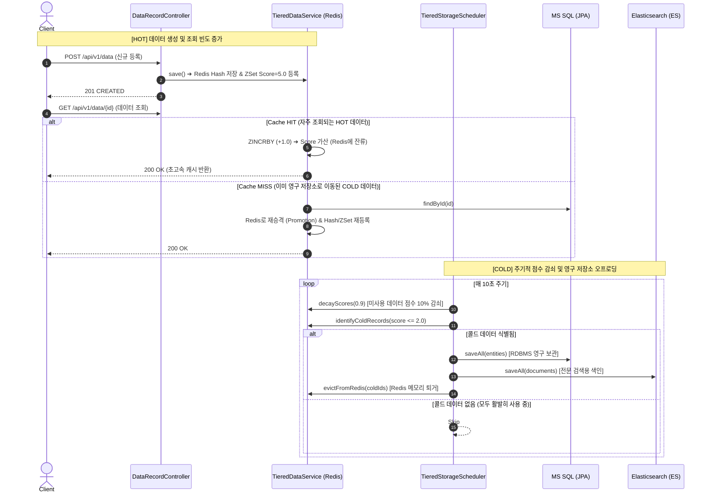
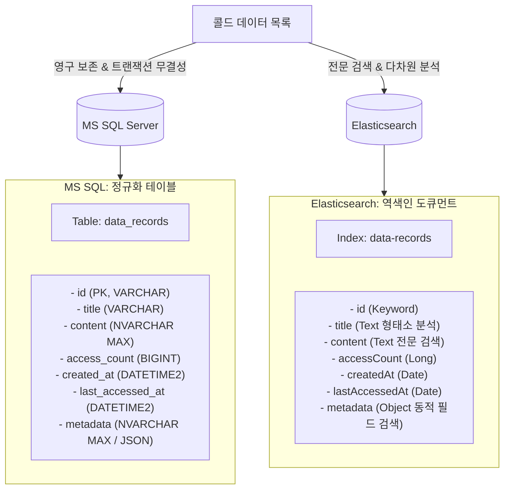

# Hot / Cold 데이터 분류 및 계층형 저장소(Tiered Storage) 구현 가이드

본 문서는 **Project Agora (Frelog)**에서 **자주 사용되는 핫(Hot) 데이터는 고성능 Redis 캐시에 유지**하고, **덜 사용되는 콜드(Cold) 데이터는 영구 저장소(MS SQL Server & Elasticsearch)로 자동 오프로드 및 아카이빙**하기 위해 구현한 아키텍처와 상세 메커니즘을 설명합니다.

---

## 1. 아키텍처 핵심 설계 원리

단순 FIFO 큐(Queue)는 데이터가 소비되는 즉시 사라지는 반면, 본 시스템은 **접근 빈도 기반 LFU (Least Frequently Used) + 시간 감쇠(Time Decay)** 알고리즘을 적용한 **계층형 캐시 구조(Tiered Storage)**를 채택했습니다.

### Redis 자료구조 조합
1. **Redis Hash (`cache:data:records`)**:
   - `Key`: 레코드 ID (`String`)
   - `Value`: 데이터 본문 JSON 문자열
   - 빠른 $O(1)$ 단건 조회 및 수정을 담당합니다.
2. **Redis Sorted Set (`cache:data:activity`)**:
   - `Member`: 레코드 ID (`String`)
   - `Score`: 유효 활동 점수 (Double, 실시간 접근 빈도 및 시간 감쇠 반영)
   - 점수 기반으로 데이터의 사용 빈도를 정렬하여 Hot과 Cold를 실시간 판별합니다.

---

## 2. 안 쓰이는 데이터의 점수는 어떻게 낮아지는가? (점수 감쇠 메커니즘)

### 2.1. 원리: 시간 경과에 따른 지수 감쇠 (Exponential Decay / Aging)
데이터가 생성되거나 조회될 때는 점수가 올라가지만, **시간이 지나도록 조회가 없는 데이터는 점수가 자연스럽게 하락**해야만 진정한 Hot/Cold 분리가 가능합니다.

이를 위해 스케줄러가 매 주기(기본 10초)마다 Redis의 모든 데이터 점수에 **감쇠 계수(Decay Factor, 기본 `0.9`)**를 곱합니다.

$$\text{New Score} = \text{Current Score} \times \text{decayFactor}\quad (\text{예: } \text{decayFactor} = 0.9)$$

* **자주 사용되는 데이터 (HOT)**:
  - 10초마다 점수가 0.9배로 줄어들더라도, 사용자의 조회(Hit)가 발생할 때마다 `+1.0`씩 점수가 충전되므로 높은 점수대(예: 10.0 ~ 50.0)를 유지하여 **Redis에 계속 잔류**합니다.
* **사용되지 않는 데이터 (COLD)**:
  - 새로운 조회가 없으므로 점수가 지속적으로 감소합니다:
    $$\text{초기 5.0} \xrightarrow{10\text{초 후}} 4.5 \xrightarrow{20\text{초 후}} 4.05 \xrightarrow{30\text{초 후}} 3.65 \dots \xrightarrow{90\text{초 후}} 1.93\dots$$
  - 점수가 설정된 임계치(`cold-threshold-score: 2.0` 이하)로 떨어지면 스케줄러에 의해 **콜드 데이터로 확정**되어 영구 저장소로 이동 후 Redis에서 제거됩니다.

### 2.2. 원자적 점수 감쇠 코드 ([TieredDataService.java](file:///Users/ihyeonsu/Documents/GitHub/project-agora/src/main/java/com/endpoint/frelog/service/TieredDataService.java))
네트워크 왕복 비용 없이 Redis 엔진 내부에서 초고속으로 점수를 일괄 감쇠시키기 위해 **Redis Lua Script**를 사용합니다:

```java
public void decayScores(double decayFactor) {
    String luaScript =
            "local key = KEYS[1]\n" +
            "local factor = tonumber(ARGV[1])\n" +
            "local items = redis.call('ZRANGE', key, 0, -1, 'WITHSCORES')\n" +
            "for i = 1, #items, 2 do\n" +
            "    local member = items[i]\n" +
            "    local score = tonumber(items[i+1])\n" +
            "    local newScore = score * factor\n" +
            "    redis.call('ZADD', key, newScore, member)\n" +
            "end\n" +
            "return #items / 2";

    DefaultRedisScript<Long> script = new DefaultRedisScript<>(luaScript, Long.class);
    redisTemplate.execute(script, Collections.singletonList(CACHE_ACTIVITY_KEY), String.valueOf(decayFactor));
}
```

---

## 3. Hot / Cold 전체 라이프사이클 (시퀀스)



---

## 4. 기준점 이하 콜드 데이터의 저장 용도 및 저장 형태 (MS SQL vs Elasticsearch)

스케줄러가 콜드 데이터를 영구 저장소로 오프로드할 때, **MS SQL과 Elasticsearch는 각각 상호보완적인 서로 다른 목적과 형태로 데이터를 저장**합니다 (CQRS 패턴).



### 4.1. MS SQL Server (관계형 데이터베이스)

#### ① 저장 용도
* **영구 데이터의 원본 저장소 (Single Source of Truth)**: RDBMS의 ACID 트랜잭션을 통해 데이터의 유실 없는 안전한 보관을 보장합니다.
* **PK 기반 정밀 조회 및 데이터 수정/삭제**: 캐시 미스 발생 시 ID 기반 포인트 조회의 기준점이 됩니다.
* **데이터 정합성 및 감사(Audit)**: 생성 일시(`createdAt`), 최종 접근 일시(`lastAccessedAt`), 누적 접근 횟수(`accessCount`)를 안정적으로 기록합니다.

#### ② 저장 형태 ([DataRecordEntity.java](file:///Users/ihyeonsu/Documents/GitHub/project-agora/src/main/java/com/endpoint/frelog/domain/jpa/DataRecordEntity.java))
정규화된 RDBMS 테이블(`data_records`)에 컬럼 단위로 매핑되어 저장됩니다:

| 컬럼명 | 데이터 타입 | 제약 조건 | 설명 |
| :--- | :--- | :--- | :--- |
| `id` | `VARCHAR(64)` | `PRIMARY KEY` | 데이터 고유 식별자 (UUID) |
| `title` | `NVARCHAR(200)` | `NOT NULL` | 데이터 제목 |
| `content` | `NVARCHAR(MAX)` | `NULL 허용` | 데이터 본문 대용량 텍스트 |
| `access_count` | `BIGINT` | `NOT NULL` | 총 누적 접근 횟수 |
| `created_at` | `DATETIME2` | `NOT NULL` | 최초 생성 일시 |
| `last_accessed_at` | `DATETIME2` | `NOT NULL` | 마지막 접근(조회) 일시 |
| `metadata` | `NVARCHAR(MAX)` | `NULL 허용` | 부가 정보를 JSON 문자열 형태로 직렬화하여 저장 |

---

### 4.2. Elasticsearch (분산 검색 및 분석 엔진)

#### ① 저장 용도
* **초고속 전문 검색 (Full-Text Search)**: 대용량 데이터에서 본문(`content`)이나 제목(`title`)에 포함된 단어, 형태소, 유사 키워드를 역색인(Inverted Index)을 통해 수 밀리초 내에 검색합니다.
* **동적 메타데이터 검색**: `metadata` 내부의 임의 속성(예: `author`, `category`, `tags` 등)에 대한 필터링 및 패싯 검색을 지원합니다.
* **실시간 통계 및 시각화**: 접근 빈도나 생성 일자 기준의 집계(Aggregation) 쿼리를 수행하고 Kibana 대시보드와 연동할 수 있습니다.

#### ② 저장 형태 ([DataRecordDocument.java](file:///Users/ihyeonsu/Documents/GitHub/project-agora/src/main/java/com/endpoint/frelog/domain/elasticsearch/DataRecordDocument.java))
JSON Document 형태로 인덱스(`data-records`)에 색인됩니다:

```json
{
  "_index": "data-records",
  "_id": "3d9a1b8e-4a62-4f01-9c3e-bfae18374d61",
  "_source": {
    "id": "3d9a1b8e-4a62-4f01-9c3e-bfae18374d61",
    "title": "2026 트렌드 리포트",
    "content": "인공지능 및 분산 캐시 아키텍처 전망...",
    "accessCount": 1,
    "createdAt": "2026-09-08T13:00:00",
    "lastAccessedAt": "2026-09-08T13:00:00",
    "metadata": {
      "author": "admin",
      "category": "tech",
      "priority": "high"
    }
  }
}
```

* `title`, `content`: 형태소 분석기(Analyzer)가 적용된 `Text` 필드로 저장되어 부분 검색 및 키워드 검색 가능.
* `metadata`: `Object` 타입으로 저장되어 `metadata.category = "tech"`와 같은 중첩 필드 검색 가능.

---

## 5. 핵심 구현 코드 발췌

### 5.1. 스케줄러의 감쇠 및 오프로딩 루프 ([TieredStorageScheduler.java](file:///Users/ihyeonsu/Documents/GitHub/project-agora/src/main/java/com/endpoint/frelog/scheduler/TieredStorageScheduler.java))

```java
@Scheduled(fixedDelayString = "${app.tiered-storage.scheduler.fixed-delay:10000}")
public void offloadColdDataToPermanentStorage() {
    long currentCacheSize = tieredDataService.getCacheSize();
    if (currentCacheSize == 0) {
        return;
    }

    // 1. 오래되었거나 조회가 없는 데이터의 점수를 점진적으로 감쇠 (Score Decay: score * 0.9)
    tieredDataService.decayScores(decayFactor);

    // 2. 점수가 임계값 이하(예: score <= 2.0)로 내려간 콜드 데이터 추출
    List<DataRecordDto> coldRecords = tieredDataService.identifyColdRecords(coldThresholdScore, batchLimit);
    if (coldRecords.isEmpty()) {
        log.debug("모든 데이터가 활발히 사용 중(HOT)입니다.");
        return;
    }

    try {
        // 3. MS SQL 영구 저장 (JPA saveAll)
        saveToMsSql(coldRecords);

        // 4. Elasticsearch 인덱싱 영구 저장 (ES saveAll)
        saveToElasticsearch(coldRecords);

        // 5. 영구 저장 성공 확인 후 Redis에서 퇴거 (메모리 절약)
        List<String> evictedIds = coldRecords.stream().map(DataRecordDto::getId).toList();
        tieredDataService.evictFromRedis(evictedIds);

        log.info("성공적으로 {}건의 콜드 데이터를 영구 저장소에 저장하고 Redis에서 퇴거했습니다.", coldRecords.size());
    } catch (Exception e) {
        log.error("오프로드 도중 에러 발생. 데이터 유실 방지를 위해 퇴거를 중단합니다.", e);
    }
}
```

---

## 6. 관련 설정 프로퍼티 ([application.properties](file:///Users/ihyeonsu/Documents/GitHub/project-agora/src/main/resources/application.properties))

```properties
# --- Tiered Storage (Hot Redis / Cold MS SQL & ES) Configuration ---
# 최초 데이터 삽입 시 부여할 초기 점수 (기본 5.0)
app.tiered-storage.initial-score=5.0

# 덜 사용된(Cold) 데이터 판별 기준 점수 (이 점수 이하인 데이터를 콜드로 간주하여 영구 저장소로 오프로드)
app.tiered-storage.cold-threshold-score=2.0

# 주기마다 적용할 점수 감쇠율 (0.9 = 10% 감쇠, 조회가 없는 데이터의 점수가 지속 하락)
app.tiered-storage.decay-factor=0.9

# 1회 스케줄러 실행 시 오프로드할 최대 건수
app.tiered-storage.batch-limit=50

# 콜드 데이터 오프로딩 스케줄러 실행 간격 (밀리초, 기본 10초)
app.tiered-storage.scheduler.fixed-delay=10000
```
