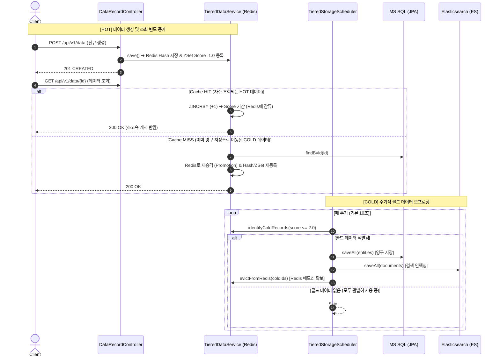

# Hot / Cold 데이터 분류 및 계층형 저장소(Tiered Storage) 구현 가이드

본 문서는 **Project Agora (Frelog)**에서 **자주 사용되는 핫(Hot) 데이터는 고성능 Redis 캐시에 유지**하고, **덜 사용되는 콜드(Cold) 데이터는 영구 저장소(MS SQL Server & Elasticsearch)로 자동 오프로드 및 아카이빙**하기 위해 구현한 아키텍처와 핵심 코드에 대해 설명합니다.

---

## 1. 아키텍처 핵심 설계 원리

기존의 단순 FIFO 큐(RPUSH / LPOP)는 데이터가 들어온 순서대로 무조건 소비되어 사라지는 반면, 본 구현은 **접근 빈도 기반 LFU (Least Frequently Used)** 알고리즘을 적용한 **계층형 캐시 구조**를 채택했습니다.

### Redis 자료구조 조합
1. **Redis Hash (`cache:data:records`)**:
   - `Key`: 레코드 ID (`String`)
   - `Value`: 데이터 본문 JSON 문자열
   - 빠른 $O(1)$ 단건 조회 및 수정을 담당합니다.
2. **Redis Sorted Set (`cache:data:activity`)**:
   - `Member`: 레코드 ID (`String`)
   - `Score`: 누적 접근 빈도수 (Double, `accessCount`)
   - 점수 기반으로 데이터의 사용 빈도를 정렬하여 Hot과 Cold를 실시간 판별합니다.

---

## 2. Hot / Cold 처리 흐름 (시퀀스)



---

## 3. 핵심 구현 코드 및 설명

### 3.1. Hot 데이터 등록 및 점수 가산 ([TieredDataService.java](file:///Users/ihyeonsu/Documents/GitHub/project-agora/src/main/java/com/endpoint/frelog/service/TieredDataService.java))

#### ① 신규 데이터 등록 (`save`)
신규 데이터가 유입되면 Redis Hash에 본문을 저장하고, Sorted Set에 기본 점수 `1.0`을 부여하여 즉시 Hot 데이터 영역에 배치합니다.

```java
public DataRecordDto save(DataRecordDto dto) {
    if (dto.getId() == null || dto.getId().isBlank()) {
        dto.setId(UUID.randomUUID().toString());
    }
    if (dto.getAccessCount() == null || dto.getAccessCount() <= 0) {
        dto.setAccessCount(1L);
    }
    dto.setLastAccessedAt(LocalDateTime.now());

    // 1. Redis Hash에 본문 JSON 저장
    saveDtoToHash(dto);

    // 2. Redis Sorted Set에 초기 빈도 점수(Score=1.0) 기록
    redisTemplate.opsForZSet().add(CACHE_ACTIVITY_KEY, dto.getId(), dto.getAccessCount().doubleValue());

    return dto;
}
```

#### ② 데이터 조회 및 Hot 상태 갱신 (`get`)
데이터 조회 시 Redis 캐시에 존재하면 `opsForZSet().incrementScore(key, id, 1.0)`를 호출하여 점수를 올립니다. 점수가 계속 올라가므로 스케줄러의 콜드 기준점 아래로 떨어지지 않아 **자주 쓰일수록 Redis에 오래 유지**됩니다.

```java
public Optional<DataRecordDto> get(String id) {
    // 1. Redis Hash 캐시 조회
    Object rawJson = redisTemplate.opsForHash().get(CACHE_RECORDS_KEY, id);
    if (rawJson != null) {
        DataRecordDto dto = deserialize(rawJson.toString());
        if (dto != null) {
            // 접근 빈도 점수 1 증가 (HOT 유지)
            Double newScore = redisTemplate.opsForZSet().incrementScore(CACHE_ACTIVITY_KEY, id, 1.0);
            long updatedCount = newScore != null ? newScore.longValue() : dto.getAccessCount() + 1;

            dto.setAccessCount(updatedCount);
            dto.setLastAccessedAt(LocalDateTime.now());
            saveDtoToHash(dto);

            return Optional.of(dto);
        }
    }

    // 2. Redis Miss 시 MS SQL에서 조회 후 Redis로 재승격(Promotion)
    Optional<DataRecordEntity> entityOpt = dataRecordJpaRepository.findById(id);
    if (entityOpt.isPresent()) {
        DataRecordDto promotedDto = convertEntityToDto(entityOpt.get());
        promotedDto.setAccessCount(promotedDto.getAccessCount() + 1);
        promotedDto.setLastAccessedAt(LocalDateTime.now());
        save(promotedDto); // Redis Hash 및 ZSet에 다시 등록하여 Hot 복원
        return Optional.of(promotedDto);
    }

    return Optional.empty();
}
```

---

### 3.2. Cold 데이터 탐색 및 Redis 퇴거 ([TieredDataService.java](file:///Users/ihyeonsu/Documents/GitHub/project-agora/src/main/java/com/endpoint/frelog/service/TieredDataService.java))

#### ① 임계치 이하 콜드 데이터 탐색 (`identifyColdRecords`)
Redis Sorted Set의 `rangeByScore(key, min, maxScore, offset, count)`를 사용하여 점수가 설정값(기본 2.0 이하)인 덜 사용된 항목들의 ID를 빠르게 추출합니다.

```java
public List<DataRecordDto> identifyColdRecords(double maxScore, int limit) {
    // 0점부터 maxScore 이하의 점수를 가진 ID들을 조회
    Set<Object> coldIds = redisTemplate.opsForZSet().rangeByScore(CACHE_ACTIVITY_KEY, 0, maxScore, 0, limit);
    if (coldIds == null || coldIds.isEmpty()) {
        return Collections.emptyList();
    }

    List<DataRecordDto> coldList = new ArrayList<>();
    for (Object rawId : coldIds) {
        String id = String.valueOf(rawId);
        Object raw = redisTemplate.opsForHash().get(CACHE_RECORDS_KEY, id);
        if (raw != null) {
            DataRecordDto dto = deserialize(raw.toString());
            if (dto != null) {
                coldList.add(dto);
            }
        }
    }
    return coldList;
}
```

#### ② Redis 메모리 퇴거 (`evictFromRedis`)
영구 저장소(MS SQL, Elasticsearch)에 안전하게 저장이 완료된 콜드 데이터만 선별하여 Redis Hash와 Sorted Set에서 삭제합니다.

```java
public void evictFromRedis(List<String> ids) {
    if (ids == null || ids.isEmpty()) {
        return;
    }

    Object[] idArray = ids.toArray();
    redisTemplate.opsForHash().delete(CACHE_RECORDS_KEY, idArray);
    redisTemplate.opsForZSet().remove(CACHE_ACTIVITY_KEY, idArray);

    log.info("Evicted {} cold records from Redis cache: {}", ids.size(), ids);
}
```

---

### 3.3. 주기적 영구 저장소 오프로딩 스케줄러 ([TieredStorageScheduler.java](file:///Users/ihyeonsu/Documents/GitHub/project-agora/src/main/java/com/endpoint/frelog/scheduler/TieredStorageScheduler.java))

`@Scheduled`를 통해 주기적으로 실행되며 다음 단계를 수행합니다:
1. 콜드 데이터 식별 (`identifyColdRecords`)
2. MS SQL 일괄 적재 (`dataRecordJpaRepository.saveAll`)
3. Elasticsearch 인덱싱 일괄 적재 (`dataRecordElasticsearchRepository.saveAll`)
4. Redis 퇴거 (`evictFromRedis`)
5. **예외 처리**: DB 또는 ES 저장 실패 시 퇴거를 중단하여 데이터 유실을 방지합니다.

```java
@Scheduled(fixedDelayString = "${app.tiered-storage.scheduler.fixed-delay:10000}")
public void offloadColdDataToPermanentStorage() {
    long currentCacheSize = tieredDataService.getCacheSize();
    if (currentCacheSize == 0) {
        return;
    }

    // 1. 임계값 이하의 콜드 데이터 목록 가져오기
    List<DataRecordDto> coldRecords = tieredDataService.identifyColdRecords(coldThresholdScore, batchLimit);
    if (coldRecords.isEmpty()) {
        return;
    }

    try {
        // 2. MS SQL 영구 저장 (JPA saveAll)
        saveToMsSql(coldRecords);

        // 3. Elasticsearch 인덱싱 영구 저장 (ES saveAll)
        saveToElasticsearch(coldRecords);

        // 4. 영구 저장 성공 확인 후 Redis에서 퇴거 (메모리 절약)
        List<String> evictedIds = coldRecords.stream().map(DataRecordDto::getId).toList();
        tieredDataService.evictFromRedis(evictedIds);

        log.info("Successfully offloaded {} cold records to permanent storage.", coldRecords.size());
    } catch (Exception e) {
        log.error("Failed to offload cold records. Aborting eviction...", e);
    }
}
```

---

## 4. 관련 환경 설정 ([application.properties](file:///Users/ihyeonsu/Documents/GitHub/project-agora/src/main/resources/application.properties))

```properties
# --- Tiered Storage (Hot Redis / Cold MS SQL & ES) Configuration ---
# 덜 사용된(Cold) 데이터 판별 기준 점수 (이 점수 이하인 데이터를 콜드로 간주하여 영구 저장소로 오프로드)
app.tiered-storage.cold-threshold-score=2.0

# 스케줄러 1회 실행 시 오프로드할 최대 건수
app.tiered-storage.batch-limit=50

# 콜드 데이터 오프로딩 스케줄러 실행 간격 (밀리초, 기본 10초)
app.tiered-storage.scheduler.fixed-delay=10000
```

---

## 5. 요약: Hot vs Cold 라이프사이클

| 상태 | 저장 위치 | 조건 | 수명 주기 동작 |
| :--- | :--- | :--- | :--- |
| **HOT** | **Redis** (메모리) | 빈번한 조회/생성 (`Score > 2.0`) | 조회 시마다 `ZINCRBY`로 점수가 가산되어 Redis 캐시에 우선 상주 (초고속 응답) |
| **COLD** | **MS SQL & Elasticsearch** (디스크) | 미사용 또는 저빈도 (`Score <= 2.0`) | 스케줄러에 의해 DB & ES로 영구 저장 후 Redis 메모리에서 퇴거 (`Evict`) |
| **RE-HOT** | **Redis로 재승격** | 콜드 상태에서 다시 조회 요청 발생 | MS SQL에서 조회 후 Redis Hash/ZSet에 재등록(`Promotion`)되어 다시 Hot 데이터로 전환 |
